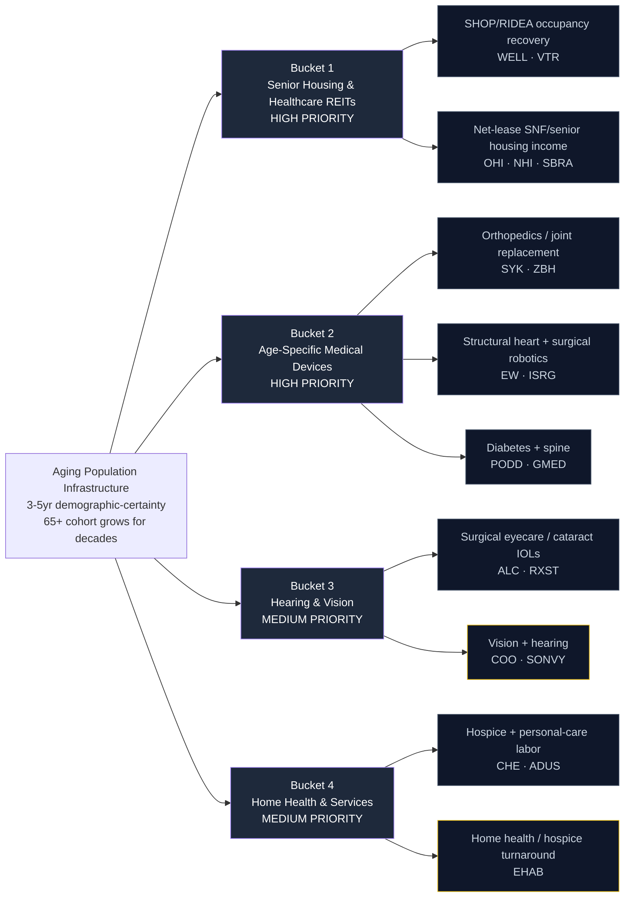

# Aging Population Infrastructure — Supply Chain Map

_Walks from the locked thesis (`thesis.md`) down to specific public companies. Four buckets matching the thesis priority ranking. Hand-curated. The three key per-leaf dimensions are cohort-linkage specificity (how directly demand tracks the 65+/80+ population), real-revenue presence, and capital structure quality. Unlike the space or defense themes, the vehicles here are deep and holdable — the discriminating question is tightness of the demographic linkage and rate/reimbursement sensitivity, not vehicle scarcity._

**Knowledge cutoff caveat:** Drafted from data current through early 2026. Note that **Amedisys (AMED) is no longer investable** — it was acquired by UnitedHealth/Optum and delisted; it appears in the Explicitly Excluded section, not the universe. Verify each remaining ticker's live state during the `candidates.md` build.

---

## The chain at a glance

_Yellow border = higher-beta / thinner or turnaround names — size as optionality._

---

## Bucket 1 — Senior Housing & Healthcare REITs (HIGH PRIORITY)

**What it is:** The real estate that houses the 65+ cohort — assisted living, memory care, independent living, and skilled nursing. The highest-operating-leverage expression of the thesis: as occupancy recovers against a decade-low new-supply pipeline, SHOP/RIDEA structures capture the upside directly rather than collecting fixed rent.

**Cohort-linkage specificity:** High for SHOP operators (WELL, VTR) whose NOI moves with move-ins and rate; moderate for net-lease landlords (OHI, NHI, SBRA) whose returns hinge on operator credit and fixed leases rather than occupancy upside.

**Key sensitivity:** Interest rates. Even with strong operations, a higher-for-longer regime pressures cap rates and refinancing — this is the central falsifier for the sleeve.

### Sub-component: SHOP/RIDEA operators (occupancy + rate recovery)

| Ticker | Company | Exposure | Note |
|--------|---------|----------|------|
| **WELL** | Welltower | Largest senior-housing REIT; big SHOP book | Flagship demand vehicle — captures occupancy + rate recovery, not just rent. Rev +38% YoY reflects SHOP consolidation |
| **VTR** | Ventas | #2 senior-housing REIT + medical office | Large SHOP book leveraged to the same recovery; cheaper on some metrics but similar rate sensitivity |

### Sub-component: Net-lease SNF / senior-housing income

| Ticker | Company | Exposure | Note |
|--------|---------|----------|------|
| **OHI** | Omega Healthcare | Triple-net SNF/ALF landlord | High-yield income; operator-credit-sensitive rather than occupancy-upside. Cleaner earnings multiple |
| **NHI** | National Health Investors | Diversified senior-housing/SNF net-lease | Conservative balance sheet, income tilt; lagged on RS (weakest 3M in the sleeve) |
| **SBRA** | Sabra Health Care | SNF-heavy net-lease | Smaller-cap, higher operator-credit risk, deeper value if the recovery holds |

---

## Bucket 2 — Age-Specific Medical Devices (HIGH PRIORITY)

**What it is:** The implants, valves, robots, and pumps whose unit volumes scale mechanically with the cohort. Joint replacements, TAVR for aortic stenosis, surgical robotics, insulin delivery, and spine — recurring, procedure-linked, and demographically underwritten.

**Cohort-linkage specificity:** Very high for the procedures that are near-universal age-driven interventions (hips/knees, TAVR, cataract-adjacent surgical robotics). Moderate for diabetes (skews younger with type-2/obesity overlap) and spine (competitive segment).

**Key sensitivity:** Reimbursement (CMS procedure rates) and near-term multiple, since several names are down double digits on the year despite the tailwind — that's the entry opportunity.

### Sub-component: Orthopedics / joint replacement

| Ticker | Company | Exposure | Note |
|--------|---------|----------|------|
| **SYK** | Stryker | Ortho + Mako robotic joints | Device anchor; joint volumes track the cohort directly. Down ~16% 1Y — forgiving entry on a durable compounder |
| **ZBH** | Zimmer Biomet | Pure-play hips/knees | Most cohort-levered large ortho name; cheapest multiple (P/E ~23) of the device sleeve |

### Sub-component: Structural heart + surgical robotics

| Ticker | Company | Exposure | Note |
|--------|---------|----------|------|
| **EW** | Edwards Lifesciences | TAVR / structural heart | Near-monopoly in TAVR; aortic stenosis is age-driven, expanding to lower-risk patients. Best RS in the sleeve (88) |
| **ISRG** | Intuitive Surgical | da Vinci surgical robotics | Install-base monopoly, razor-blade instrument model; procedure mix skews older. Down ~19% 1Y despite +23% rev growth |

### Sub-component: Diabetes + spine

| Ticker | Company | Exposure | Note |
|--------|---------|----------|------|
| **PODD** | Insulet | Omnipod insulin delivery | Type-2 expansion tracks aging + obesity; +34% rev growth but sold off hard (−47% 1Y) — higher-beta, watch entry |
| **GMED** | Globus Medical | Spine + enabling robotics | Degenerative spine is age-driven; post-NuVasive scale, cheap (P/E ~19) but competitive segment |

---

## Bucket 3 — Hearing & Vision (MEDIUM PRIORITY)

**What it is:** The franchises addressing near-universal age-driven sensory decline — cataracts, presbyopia, and hearing loss. Cataract surgery in particular is one of the most demographically certain procedures on earth.

**Cohort-linkage specificity:** High for surgical eyecare / cataract IOLs (ALC, RXST). Lower for Cooper (contact lenses skew younger) and hearing aids where the purest players are foreign/thin.

**Key sensitivity:** Elective-procedure timing and, for the ADR, liquidity.

### Sub-component: Surgical eyecare / cataract IOLs

| Ticker | Company | Exposure | Note |
|--------|---------|----------|------|
| **ALC** | Alcon | Global #1 surgical eyecare (IOLs) | Cataract is near-universal age-driven; global leader. Lagged (−21% 1Y) — value in a certain franchise |
| **RXST** | RxSight | Light-adjustable IOL pure-play | Premium cataract-upgrade optionality; micro-cap (~$230M), unprofitable, −55% 1Y — pure optionality, size small |

### Sub-component: Vision + hearing

| Ticker | Company | Exposure | Note |
|--------|---------|----------|------|
| **COO** | Cooper Companies | CooperVision lenses + CooperSurgical | Myopia/presbyopia demand; less purely geriatric, but durable and diversified |
| **SONVY** | Sonova Holding (ADR) | Hearing aids | The one holdable hearing-aid vehicle — sponsored ADR, ~$15B mcap, adequate liquidity (unlike Demant/Amplifon). Hearing loss is squarely age-driven |

---

## Bucket 4 — Home Health & Services (MEDIUM PRIORITY)

**What it is:** The services that follow the cohort as it ages in place — hospice, personal-care labor, and home health. Aging-in-place shifts care out of facilities and into the home, against a structurally short home-care labor supply.

**Cohort-linkage specificity:** High for hospice (end-of-life demand is demographically certain) and personal-care labor. The sub-bucket's returns depend heavily on reimbursement (Medicare/Medicaid) and labor availability.

**Key sensitivity:** Reimbursement politics and wage inflation on a scarce labor pool.

### Sub-component: Hospice + personal-care labor

| Ticker | Company | Exposure | Note |
|--------|---------|----------|------|
| **CHE** | Chemed | VITAS hospice + Roto-Rooter | VITAS is the largest US hospice operator; end-of-life demand is certain. Diluted by Roto-Rooter but clean, cash-generative. Best RS in the universe (100) |
| **ADUS** | Addus HomeCare | Personal-care services pure-play | Directly the structurally short home-care labor supply; Medicaid-funded aging-in-place. Small-cap, real revenue |

### Sub-component: Home health / hospice turnaround

| Ticker | Company | Exposure | Note |
|--------|---------|----------|------|
| **EHAB** | Enhabit | Home health + hospice | Encompass spin-off; smaller, leveraged, strategic-review/turnaround optionality on the same home-health demand. +89% 1Y — momentum, but size as optionality |

---

## Explicitly Excluded

Names deliberately left out of the universe, with the reason:

| Ticker / Name | Why excluded |
|---------------|--------------|
| **AMED** (Amedisys) | **No longer investable** — acquired by UnitedHealth/Optum and delisted. Was the obvious home-health pure-play; its demand is now inside UNH. Benchmark-only context, not holdable. |
| **Demant A/S** (Denmark) | Hearing-aid oligopoly leader but trades as a thin/unsponsored ADR — not cleanly holdable in a standard US brokerage. Benchmark-only for the hearing-aid sub-theme. |
| **Amplifon** (Italy) | Hearing-aid retail leader, foreign-listed / thin US ADR. Same liquidity problem as Demant — benchmark-only. |
| **Longevity / anti-aging biotech** (senolytics, etc.) | Binary clinical risk, no near-term cash flow. This theme owns infrastructure for people who are already old, not the moonshot to reverse aging. Over-hyped per thesis. |
| **UnitedHealth / Humana / large managed care** | Real aging exposure but dominated by broad managed-care dynamics, regulation, and MA-rate politics — the demographic linkage is far too diluted to be a clean vehicle. |
| **Diversified hospital REITs / big-cap pharma** | Aging is a tailwind but not the primary driver; exposure too diluted to express the specific bet. |

---

## Cross-bucket notes

### Bottleneck / cohort-linkage specificity ranking (1 = most diluted, 5 = tightest demographic linkage)

| Sub-component | Rating | Notes |
|---------------|--------|-------|
| WELL (SHOP senior housing) | **5** | Highest operating leverage to the 80+ move-in inflection against frozen supply |
| SYK (orthopedics + Mako) | **5** | Joint-replacement volumes are a near-mechanical function of the cohort |
| EW (TAVR / structural heart) | **5** | Aortic stenosis is age-driven; near-monopoly vehicle |
| ISRG (surgical robotics) | **5** | Install-base monopoly; older-skewing procedure mix |
| ALC (cataract IOLs) | **5** | Cataract is among the most demographically certain procedures globally |
| VTR (SHOP + MOB) | 4 | Same recovery as WELL, slightly more diluted mix |
| ZBH (pure-play ortho) | 4 | Most cohort-levered large ortho name |
| PODD (insulin delivery) | 4 | Strong linkage but skews younger via type-2/obesity |
| RXST (adjustable IOLs) | 4 | Tight linkage but pre-profit, micro-cap execution risk |
| AMED-successor via ADUS (home-care labor) | 4 | Directly the short labor supply |
| OHI / NHI / SBRA (net-lease) | 2-3 | Operator-credit and lease-driven rather than occupancy upside |
| COO (vision) | 3 | Diversified; lens demand skews younger |
| SONVY (hearing aids ADR) | 3 | Age-driven demand but diluted by being the only holdable proxy |
| CHE (hospice + Roto-Rooter) | 3 | VITAS is a pure aging vehicle; Roto-Rooter dilutes the linkage |
| GMED (spine) | 3 | Age-driven but competitive segment |
| EHAB (home health turnaround) | 2 | Right demand, but returns hinge on the turnaround, not the demographic |

### Where the thesis is most concentrated (single-name dependence)

- **WELL** is the flagship — the highest-operating-leverage occupancy-recovery vehicle and the demand anchor.
- **SYK + EW** anchor the device story — the two tightest cohort-linkage compounders with real cash flow.
- **CHE** is the cleanest home-health/hospice cash generator after AMED's delisting removed the obvious pure-play.

If any of WELL, SYK, or EW has an idiosyncratic issue (rate shock for WELL, reimbursement or recall for the devices), the sleeve thins materially — a portfolio-construction note for `scoring.md`.

---

_Next step: `_universe.json` → `_seed_from_universe.py` → `_score_run.py` applies the long-only rubric and shortlists the tracker._
