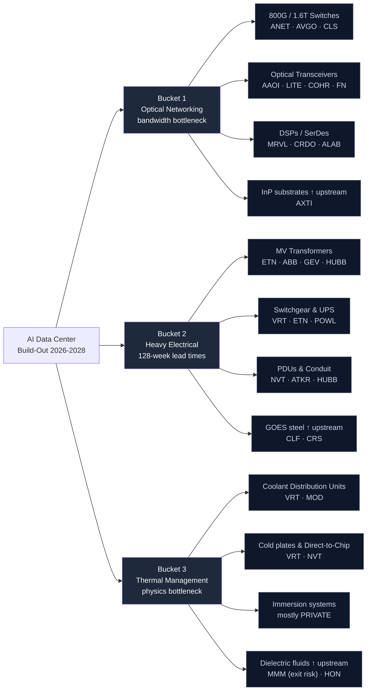

# AI Data Center Build-Out — Supply Chain Map

_Walks from the locked thesis (`thesis.md`) down to specific public companies. Three buckets, each split into sub-components, each sub-component mapped to public tickers and any critical private/upstream players. Hand-curated. Bottleneck specificity and lead times are the two key dimensions per leaf node._

**Knowledge cutoff caveat:** Drafted from data current through early 2025. Some 2025-2026 entrants (especially in CDUs, optical-CPO, and immersion cooling) may be missing — flagged inline where I'm aware of the gap. Verify the ticker list against current SEC filings during the `candidates.md` build.

---

## The chain at a glance

_"↑ upstream" indicates a raw material or component one level above the data-center buyer. These are often the tightest bottlenecks — fewer suppliers, more specialized, harder to substitute._

---

## Bucket 1 — Optical Networking (The Bandwidth Bottleneck)

**What it is:** As AI training and inference clusters scale to tens of thousands of GPUs across multiple racks, the interconnect between them becomes a binding constraint. Every NVIDIA H100/B100 cluster needs vast amounts of optical fiber, transceivers (the modules that convert electrical signals to light and back), and high-speed switches. The industry is transitioning from 400G to 800G now, with 1.6T on the near horizon.

**Bottleneck specificity:** Mixed. Switch silicon and DSPs are highly concentrated (2-3 global suppliers). Transceiver assembly is more competitive but the underlying lasers and indium phosphide substrates are scarce. Upstream materials (InP wafers) are a hard physical bottleneck — measured in tons of global capacity.

**Lead times:** 12-24 weeks for transceivers; 4-8 weeks for switches under normal conditions but currently extended. Upstream InP substrates have multi-quarter lead times.

### Sub-component: 800G/1.6T Ethernet switches

The "backbone" piece. Switches need application-specific silicon (Broadcom's Tomahawk series dominates) plus packaging. Nvidia's Spectrum-X and AMD's Pensando are emerging competitors but Broadcom holds the majority share of merchant silicon.

| Ticker | Role in this sub-bucket | Bottleneck specificity |
|--------|------------------------|------------------------|
| **AVGO** (Broadcom) | Switch silicon (Tomahawk 5, Jericho) — the merchant standard | Hard to substitute, duopoly with Marvell at this tier |
| **ANET** (Arista Networks) | The dominant data-center switch OEM building on Broadcom silicon | Strong customer moat with hyperscalers; software differentiation |
| **CLS** (Celestica) | Contract manufacturer of 800G switches (HPS division) — picking up share as Arista expands and hyperscalers buy white-box | Less moat, but operating leverage to the cycle |

### Sub-component: Optical transceivers (DR4, FR4, 2xFR4, OSFP)

The pluggable modules. Pricing pressure is real here but unit volumes are exploding fast enough that revenue grows even as ASPs decline.

| Ticker | Role | Bottleneck specificity |
|--------|------|------------------------|
| **AAOI** (Applied Optoelectronics) | 800G transceivers, recently won big hyperscaler programs | Mid-tier player; thesis depends on share gains |
| **LITE** (Lumentum) | Lasers and optical components, vertically integrated | Strong upstream position in InP-based lasers |
| **COHR** (Coherent) | Lasers, datacom optics — merged with II-VI giving them scale | Broad portfolio; some commodity exposure |
| **FN** (Fabrinet) | Contract manufacturer for most of the optical industry — including for LITE, COHR | Picks-and-shovels to the picks-and-shovels |

**Note on 2025-2026 entrants:** Co-Packaged Optics (CPO) is the emerging architecture where the optical engine moves onto the same package as the switch silicon. Broadcom, Marvell, and several startups are competing. CPO disrupts pluggable transceivers — could be a tailwind to AVGO/MRVL and a headwind to AAOI/LITE over a 2-3 year horizon. Watch for commercial deployments.

### Sub-component: DSPs and SerDes (the chips inside transceivers)

| Ticker | Role | Bottleneck specificity |
|--------|------|------------------------|
| **MRVL** (Marvell) | Leading PAM4 DSPs for 800G transceivers; custom silicon programs with hyperscalers | Concentrated supplier — high moat |
| **CRDO** (Credo Technology) | AECs (Active Electrical Cables) and SerDes — alternative to optical for short reach | Smaller cap, fastest growth, riding the share-gain narrative |
| **ALAB** (Astera Labs) | PCIe/CXL retimers and switches for inside-rack connectivity | Adjacent to the optical thesis; recent IPO |

### Sub-component (upstream): Indium phosphide substrates

| Ticker | Role | Bottleneck specificity |
|--------|------|------------------------|
| **AXTI** (AXT Inc.) | One of few US-listed pure-plays in InP wafers | **Extreme** — physical bottleneck, very few global suppliers; AXT has had quality issues but remains structurally positioned |

**Private/upstream players worth knowing:**
- **Sumitomo Electric** (private/Japanese parent) and **JX Nippon** — dominant InP wafer producers globally; AXTI is the US-listable proxy.
- **Nvidia** — increasingly verticalizing networking (Mellanox + Spectrum-X), changing competitive dynamics for ANET over time.

---

## Bucket 2 — Heavy Electrical Distribution (The 128-Week Bottleneck)

**What it is:** Once power reaches a data center site, it must be stepped down from grid voltage (typically 138-345 kV) to rack voltage (480V or 415V) and then to server level. This requires medium-voltage transformers, switchgear, busways, UPS systems, and increasingly sophisticated power distribution units (PDUs). The 128-week transformer lead time the thesis hinges on is real and binding.

**Bottleneck specificity:** **Highest of the three buckets.** Few global suppliers of large MV transformers (ABB, Siemens, GE, Hitachi/Mitsubishi — and one or two US-listed ways to play). Grain-oriented electrical steel (GOES) is the upstream constraint — only a handful of mills globally can produce it at the required grade. Switchgear and UPS are more competitive but still capacity-constrained.

**Lead times:**
- MV transformers: 100-128 weeks (varies by size)
- Switchgear: 40-80 weeks
- UPS systems: 20-40 weeks
- Standard PDUs and busways: 12-30 weeks

### Sub-component: Medium-voltage transformers

| Ticker | Role | Bottleneck specificity |
|--------|------|------------------------|
| **ETN** (Eaton) | Most direct US-listed exposure to MV transformers, switchgear, and power distribution. Massive backlogs. | **Extreme**; pricing power is real |
| **ABB** (ABB ADR — Swiss parent) | Global #1 in MV/HV transformers and switchgear. ADR-tradeable for US accounts. | Extreme; full backlog through 2027+ |
| **GEV** (GE Vernova) | Spun out of GE in 2024. Power equipment including transformers, plus gas turbines and grid solutions. | High; benefits from same backlog dynamic |
| **HUBB** (Hubbell) | Electrical components including transformers and grid hardware. Smaller and more diversified. | Moderate |

### Sub-component: Switchgear, UPS, and rack-level power

| Ticker | Role | Bottleneck specificity |
|--------|------|------------------------|
| **VRT** (Vertiv) | Data-center-specific power and thermal: Liebert UPS, switchgear, PDUs. Pure-play exposure. | High — most direct DC capex beneficiary |
| **ETN** | (also here — UPS and switchgear cross over) | High |
| **POWL** (Powell Industries) | Custom electrical houses, switchgear for industrial/utility — picking up data-center share | Moderate, narrower customer base |

### Sub-component: PDUs, busways, conduit, cable management

The unglamorous but high-volume "last mile" of data-center power. Less moat than transformers but volumes scale 1:1 with capacity.

| Ticker | Role | Bottleneck specificity |
|--------|------|------------------------|
| **NVT** (nVent Electric) | Enclosures, cable management, busways — and increasingly liquid cooling | Moderate; positions in both Bucket 2 and 3 |
| **ATKR** (Atkore) | Electrical conduit, cable management, busbars | Lower (more commodity); but huge data-center exposure |
| **HUBB** | (also here) | Moderate |

### Sub-component (upstream): Grain-oriented electrical steel (GOES)

The single most underappreciated bottleneck of the entire thesis. GOES is the specialty steel used in transformer cores. Global capacity is constrained. The US imports a significant share, and trade policy could either help (tariffs benefit US producers) or hurt (input cost pressure).

| Ticker | Role | Bottleneck specificity |
|--------|------|------------------------|
| **CLF** (Cleveland-Cliffs) | Largest US producer of electrical steel post-AK Steel acquisition | **Extreme** — limited global suppliers |
| **CRS** (Carpenter Technology) | Specialty alloys including some electrical steel grades | Moderate |

**Private/foreign upstream:**
- **Nippon Steel, POSCO, Thyssenkrupp** — large foreign GOES producers; not directly investable but their capacity decisions affect US supply.
- **Siemens Energy** (SMAWF / SMNEY) — direct competitor to ABB/GEV in transformers; ADR-tradeable but illiquid.

---

## Bucket 3 — Thermal Management (The Physics Bottleneck)

**What it is:** Air cooling tops out at roughly 40-50 kW per rack. New AI accelerator generations (H200, B200, MI300X, and their successors) push rack densities to 100-200 kW. The physics doesn't allow air to remove that heat at scale, so the industry is transitioning to direct-to-chip liquid cooling and immersion cooling. This is the smallest market by absolute size today but the fastest-growing — and the hardest to find good public-market vehicles for.

**Bottleneck specificity:** **High at the system level, mixed at the component level.** Liquid cooling integrators are scarce and specialized. But many of the most innovative companies in this space are private (CoolIT, Submer, JetCool, LiquidStack, Iceotope, Stäubli for quick disconnects). The largest public players are HVAC giants pivoting to data-center liquid cooling — earning a meaningful but not pure-play exposure.

**Lead times:**
- CDUs (Coolant Distribution Units): 16-30 weeks, lengthening
- Custom liquid cooling integration: 6-12 months for large deployments
- Cold plates and quick disconnects: 8-16 weeks (Stäubli is the dominant private supplier)

### Sub-component: Coolant Distribution Units (CDUs)

The "heart" of a liquid cooling system — pumps the coolant between heat-exchanger loops and the rack manifolds.

| Ticker | Role | Bottleneck specificity |
|--------|------|------------------------|
| **VRT** (Vertiv) | CoolIT partnership + in-house Liebert thermal; arguably the best public pure-play on data-center liquid cooling | High |
| **MOD** (Modine Manufacturing) | Heat exchangers and CDUs (Airedale brand acquisition gave them a UK data-center thermal footprint) | High; fastest-growing thermal segment |

### Sub-component: Cold plates and Direct-to-Chip systems

| Ticker | Role | Bottleneck specificity |
|--------|------|------------------------|
| **VRT** | (cold plate integration via CoolIT partnership) | High |
| **NVT** (nVent Electric) | Acquired ECM Industries; building liquid cooling portfolio | Moderate but growing fast |
| **AAON** | Custom HVAC including some data-center; less liquid cooling exposure to date | Lower |

### Sub-component: Immersion cooling systems

**Heads up — most of this market is private.** This is the "thesis right but vehicles wrong" risk in Bucket 3.

**Private leaders:**
- **Submer** (Spain) — single-phase immersion
- **GRC / Green Revolution Cooling** (US) — large-tank immersion
- **LiquidStack** (US, spun out of Bitfury) — two-phase immersion
- **Iceotope** (UK) — chassis-level immersion
- **JetCool** (US) — micro-convective direct cooling

Public-market exposure to immersion is **indirect**: through HVAC giants (CARR, JCI, TT) that may acquire one of the private leaders, or through chemical companies that supply the dielectric fluids (below).

### Sub-component (upstream): Dielectric fluids

| Ticker | Role | Bottleneck specificity |
|--------|------|------------------------|
| **MMM** (3M) | Historically dominant in Novec fluids for two-phase immersion. **Critical risk: 3M announced exit from PFAS-based products by end of 2025.** Creates a major supply gap. | High but DECLINING due to exit |
| **HON** (Honeywell) | Has some thermal materials including potential PFAS alternatives | Lower today but a watch-list candidate |
| **Cargill** (private) — hydrocarbon dielectrics | — | — |

The 3M exit is genuinely important. It's both a falsifier risk for the immersion-cooling sub-thesis (if no scalable replacement emerges by 2026) and a potential opportunity if a public-listed alternative scales up.

---

## Cross-bucket notes

### Names that span multiple buckets

- **VRT (Vertiv)** appears in both Bucket 2 (UPS, switchgear) and Bucket 3 (CDUs, cold plates). It is the single most thesis-concentrated public name in the entire supply chain. **Likely to be the highest-conviction tracker candidate.**
- **NVT (nVent)** spans Bucket 2 (containment, busways) and Bucket 3 (liquid cooling integration). Less pure but more diversified.
- **ETN (Eaton)** spans MV transformers, switchgear, and UPS within Bucket 2. The flagship of the heavy-electrical bet.

### Bottleneck specificity ranking (1 = most replaceable, 5 = hardest to substitute)

| Sub-component | Rating | Notes |
|---------------|--------|-------|
| MV Transformers / GOES steel | **5** | Few suppliers globally, 128-week lead times |
| Switch silicon (AVGO, MRVL) | **5** | Effective duopoly |
| InP substrates (AXTI) | **5** | Physical materials bottleneck |
| Liquid cooling integration (VRT, MOD) | **4** | Few qualified integrators; private competition |
| Switchgear / UPS | **4** | Limited supply, growing demand |
| Optical transceivers | **3** | Multiple suppliers but capacity-constrained |
| PDUs / conduit / containment | **2** | More commoditized; volume play |
| Cold plate hardware | **2** | Many private and public options |
| Dielectric fluids | **3** | 3M exit creates near-term scarcity, long-term substitution risk |

### Where the "thesis right, vehicles wrong" risk concentrates

1. **Bucket 3 (Thermal) — Immersion cooling.** The best growth is in private companies. If a major hyperscaler acquires Submer or GRC, the public-market expression of that sub-thesis evaporates overnight.
2. **AAOI / LITE if CPO accelerates.** A 2-3 year horizon could see pluggable transceivers compressed by co-packaged optics, with AVGO and MRVL capturing the value instead.
3. **Hyperscaler vertical integration in switches.** Nvidia Spectrum-X and AMD Pensando are taking share from merchant silicon at the edge of the market. AVGO is dominant but not immune.

### Where the thesis is most concentrated (single-name dependence)

- **VRT** for thermal + power exposure
- **ETN** for heavy electrical
- **AVGO** for switch silicon and merchant networking

If any of these three names had an idiosyncratic issue (accounting, leadership, geopolitical exposure), it would meaningfully dent the thesis even if the broader build-out continues. Worth treating as a portfolio-construction note in `scoring.md`.

### Open research questions before `candidates.md`

1. **Verify 2025-2026 entrants in CDUs and direct-to-chip cooling.** A few new SPAC / IPO entrants may have emerged that my knowledge cutoff missed.
2. **CPO commercial deployment status.** When the first true co-packaged optics systems ship in volume, the LITE/AAOI thesis weakens.
3. **3M PFAS exit timeline.** Confirm the exit date and identify any public-listed replacement supplier.
4. **GEV (GE Vernova) heavy electrical revenue breakdown.** How much of GEV revenue is transformers vs. gas turbines vs. grid software? Pure-play exposure matters for scoring.
5. **Hyperscaler private-investment activity.** Are MSFT, GOOG, META, AMZN making direct minority investments in CoolIT, Submer, etc.? If yes, that's both a thesis confirmation and a "vehicles wrong" warning.

---

_Next step: `candidates.md` — pull fundamentals (mkt cap, P/S, P/E, revenue growth, RS rank, 1Y%) for the ~20 names identified above, populate the per-candidate write-ups, and prepare the shortlist for scoring._

---

## Addendum — 2026-05-16 — Research findings R1-R5

Resolved the five open research questions via web research. Several findings are **material** — they don't break the locked thesis but they update which public-market vehicles are best positioned. Action items at the end of this section.

### R1 — Co-Packaged Optics (CPO) deployment status

**Finding (Medium-High confidence):** CPO has moved from demo to early commercial deployment. Broadcom shipped >50,000 Tomahawk 5-Bailly CPO switches in 2025 and launched the 102.4 Tbps Tomahawk 6 "Davidson" with 200G-lane CPO. Meta is publicly trialing. **But** the 1.6T module rollout in 2026-2027 is still dominated by pluggables — Broadcom's March 2026 Taurus 1.6T DSP is for traditional transceivers, not CPO. Mass hyperscaler CPO conversion remains 1-3 years out.

**Implication for thesis:** AAOI / LITE / COHR pluggable-transceiver thesis has a ~2-year runway before serious disruption. Within the locked thesis time horizon (12-24 months), CPO disruption is a tail risk, not a base case. **No change to tracker today.** But CRDO's AEC (Active Electrical Cables) thesis is *strengthened* — AECs sidestep optical entirely and benefit if CPO+pluggable transitions are messy.

### R2 — 3M PFAS / Novec exit confirmed

**Finding (High confidence):** Exit completed on schedule. Last-order deadline March 31, 2025; Novec manufacturing ceased end of 2025. **Replacement supply chain:** Syensqo (Solvay spinoff, EBR:SYENS — Galden PFPE fluids) is the most direct drop-in substitute being adopted in immersion cooling. Chemours, Honeywell, and several private specialty-chem players also filling gaps.

**Implication for thesis:** The dielectric-fluids sub-thesis now has a clearer public vehicle: **Syensqo (SYENS on Brussels exchange)**. ADR availability and US-account accessibility need to be verified. MMM's downgrade in the original scoring (rank 23, score 38) is validated — they're out. HON remains a watch-list speculative play for alternative materials.

### R3 — GE Vernova revenue mix — IMPORTANT

**Finding (Medium confidence — figures approximated from FY2025 results + 2026 guides):**
- Total FY2025 revenue: $38.1B (+9% YoY)
- **Power segment: ~$19-20B (~50%)** — gas turbines + nuclear services (the dominant slice)
- **Electrification: ~$10-11B (~28%)** — grid equipment, transformers, grid software (growing ~25% organic; 2026 guided to $13.5-14B incl. Prolec GE acquisition)
- **Wind: ~$8-9B (~22%)** — declining high-single-digits, ~$400M EBITDA loss

**Implication for thesis: GEV is materially less "pure-play" on the AI infrastructure thesis than originally scored.** Only ~28% of revenue is in the segment the thesis cares about. Gas turbines (50%) are arguably a related-but-different bet (general electrification demand, not AI specifically).

**Recommended action: downsize GEV in the tracker** — or replace with a more pure-play electrification name. Two candidates that came up implicitly: ETN already overweighted, Prolec GE (now inside GEV via acquisition) is the actual transformer story. A possible swap is to *trim GEV from tracker rank 4 to "watching"* and promote one of the previously-7th-rank names. Decision deferred to user.

### R4 — 2025-26 liquid cooling public entrants — VERY IMPORTANT

**Finding (High confidence):** No notable IPOs in data-center liquid cooling 2025-26. Path to liquidity has been **acquisition by industrial strategics**, not public markets:

| Private co. | Acquirer | Date | Deal |
|---|---|---|---|
| **CoolIT** | **Ecolab (ECL)** | Mar 2026, closes Q3 2026 | **$4.75B** |
| **LiquidStack** | **Trane Technologies (TT)** | Feb 2026 | undisclosed |
| **JetCool** | **Flex (FLEX)** | Late 2024 | undisclosed |

Submer, Iceotope, GRC remain private. Iceotope raised $26M Series B in May 2026.

**Implication for thesis: this is a major addition to the supply chain map.** The "best public-market vehicles for liquid cooling" now include:
- **ECL (Ecolab)** — about to own CoolIT, which was *the* leading direct-to-chip provider. ECL is a $66B specialty chemical & services company with a real AI-cooling pivot.
- **TT (Trane Technologies)** — owns LiquidStack (two-phase immersion).
- **FLEX (Flex)** — owns JetCool (micro-convective cooling).

**Critical implication for VRT:** VRT's CoolIT partnership is now compromised — CoolIT will sit inside Ecolab post-Q3 2026. VRT either re-papers the relationship or builds in-house. This is a *negative* for VRT's thermal pure-play story and a *positive* for ECL.

**Recommended actions:**
1. Add ECL to candidates next refresh and score it
2. Consider TT and FLEX for the same
3. Re-evaluate VRT's conviction given CoolIT changing hands
4. Confirm SYENS (Syensqo) accessibility for US accounts and add if tradeable

### R5 — Hyperscaler private investments

**Finding (Medium-High confidence):** No public evidence of direct hyperscaler equity investments in the major private liquid-cooling cos. Hyperscalers engage via commercial trials and supplier partnerships (Microsoft/Meta/Google with Submer; Meta with Asperitas), but they're not capturing the upside via venture stakes. The 2024-26 cooling rounds and exits went to PE, industrial strategics (ECL/TT/FLEX), or non-hyperscaler VCs.

**Implication for thesis:** This is the *cleaner* outcome for our "thesis right but vehicles wrong" risk in Bucket 3. The risk was that hyperscalers would acquire the leaders before public investors could participate. That hasn't happened. Instead, the value flowed through public industrial acquirers — exactly the vehicles our thesis can hold.

**Cross-cutting takeaway:** Both R4 and R5 reinforce the same insight — **public industrial acquirers** (ECL, TT, FLEX) are absorbing the best private cooling assets. This is a genuine pivot point for the thesis vehicles list.

### Summary of recommended actions (for user review)

1. **Tracker reshuffle candidate:** Consider trimming GEV (only ~28% AI-relevant revenue) and adding ECL (becoming the dominant direct-to-chip cooling owner via $4.75B CoolIT acquisition closing Q3 2026).
2. **Add to next candidates refresh:** ECL, TT (already a mega-cap HVAC), FLEX, and SYENS (Brussels listing — confirm US-account access).
3. **VRT conviction re-check:** Their CoolIT partnership is changing hands. Not necessarily a thesis-breaker, but worth confirming VRT's in-house thermal capability before next quarterly review.
4. **No change required to locked thesis itself** — the picks-and-shovels framing remains intact. The supply chain map gets richer with the strategic-acquirer angle.

_End of 2026-05-16 addendum._

