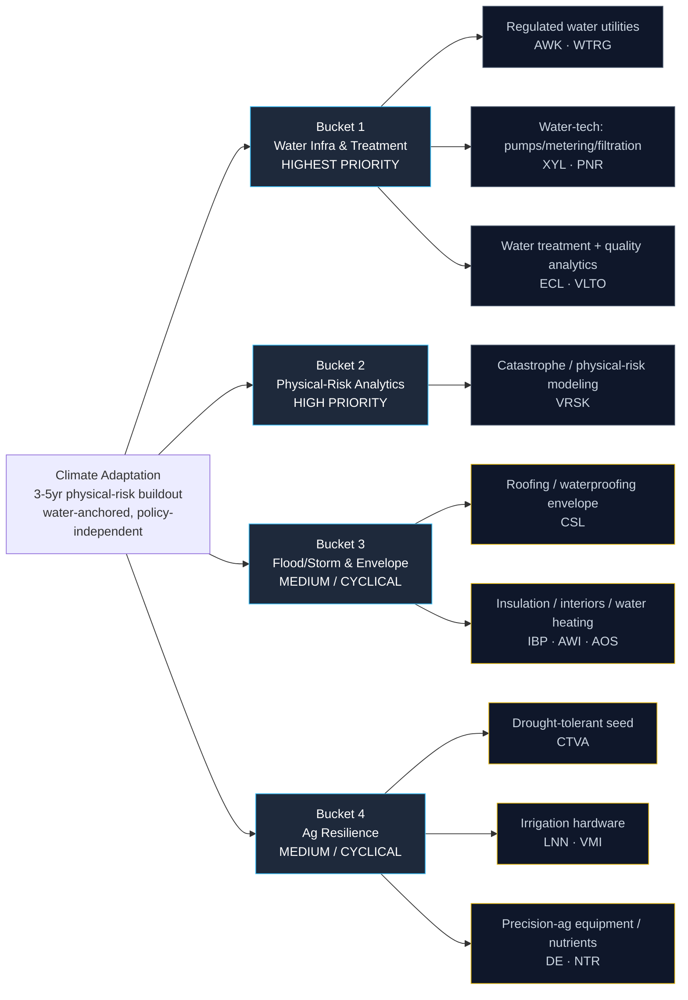

# Climate Adaptation Infrastructure — Supply Chain Map

_Walks from the locked thesis (`thesis.md`) down to specific public companies. Four buckets matching the thesis priority ranking. Hand-curated. The three key dimensions per leaf node are **reimbursement depth** (is the spend recovered through a rate base / insurance / non-discretionary budget?), **secular-vs-cyclical** (does the adaptation signal dominate the housing/ag cycle?), and **bottleneck specificity** (how hard is the input to substitute?)._

**Scope discipline:** This is ADAPTATION, not MITIGATION. Solar, wind, EV, hydrogen, and carbon-capture names are deliberately excluded — they depend on emissions policy and subsidy. Adaptation dollars flow regardless. Foreign-only water names (Veolia, Geberit) are benchmark-only, not holdable US vehicles.

---

## The chain at a glance

_Yellow border = cyclical satellite — adaptation signal competes with the housing/ag cycle._

---

## Bucket 1 — Water Infrastructure & Treatment (HIGHEST PRIORITY)

**What it is:** The deepest, most durable, most-reimbursed pool of adaptation dollars. Regulated water utilities recover capex through a growing rate base; water-tech supplies the pumps, meters, and membranes; water-quality analytics sells instruments plus recurring consumables. This is where the thesis says the compounding is most durable.

**Reimbursement depth:** Very high. Utility capex is recovered through regulated returns; treatment/analytics spend is driven by non-discretionary regulatory standards (lead, PFAS).

**Bottleneck specificity:** High. Regulated utilities have geographic monopolies; water-quality instruments (Hach/Veralto) have razor-and-blade consumable lock-in.

### Sub-component: Regulated water utilities

| Ticker | Company | Exposure | Note |
|--------|---------|----------|------|
| **AWK** | American Water Works | Largest US regulated water/wastewater utility | Rate-base compounder; the "boring, reimbursed" anchor. Scarcity gets priced into the rate base |
| **WTRG** | Essential Utilities | Aqua America water + Peoples gas | Regulated water grower, but a gas segment dilutes purity |

### Sub-component: Water-tech — pumps / smart metering / filtration

| Ticker | Company | Exposure | Note |
|--------|---------|----------|------|
| **XYL** | Xylem | Pumps, transport, Sensus smart metering, analytics | Purest large-cap water-tech pure-play; the "what we actually want" reference |
| **PNR** | Pentair | Residential/commercial water treatment, filtration, pool | Real water-scarcity exposure with a consumer-cyclical tilt |

### Sub-component: Water treatment + quality analytics

| Ticker | Company | Exposure | Note |
|--------|---------|----------|------|
| **ECL** | Ecolab | Industrial water treatment + hygiene | Compounder with water-scarcity pricing power; premium multiple |
| **VLTO** | Veralto | Water-quality instruments + consumables (Hach, Trojan, ChemTreat) | Razor-and-blade recurring water testing; high specificity |

---

## Bucket 2 — Physical-Risk Analytics (HIGH PRIORITY)

**What it is:** The layer that literally prices flood, wind, and wildfire risk for insurers, reinsurers, and lenders. As physical risk gets harder to price, the model owner's pricing power grows. Small in vehicle count but extremely high specificity and margin.

**Reimbursement depth:** High — embedded in insurer underwriting budgets, a standing (not event-driven) line item.

**Bottleneck specificity:** Very high — switching costs are enormous once a model is wired into underwriting workflows.

### Sub-component: Catastrophe / physical-risk modeling

| Ticker | Company | Exposure | Note |
|--------|---------|----------|------|
| **VRSK** | Verisk Analytics | Catastrophe modeling + insurance analytics | Recurring-subscription, high-margin, embedded in underwriting. The company that prices the theme |

---

## Bucket 3 — Flood / Storm Resilience & Building Envelope (MEDIUM / CYCLICAL)

**What it is:** The physical products that keep water and storms out of buildings — roofing/waterproofing membranes, insulation, ceilings, and water heating. Real resilience exposure, but demand is dominated by the housing and non-res-construction cycle. **Names here must clear a higher bar on the secular-vs-cyclical split to be promoted.**

**Reimbursement depth:** Medium — re-roof and remediation are non-discretionary; new construction is cyclical.

**Bottleneck specificity:** Medium — differentiated products (Carlisle membranes) but broadly competitive categories.

### Sub-component: Roofing / waterproofing envelope

| Ticker | Company | Exposure | Note |
|--------|---------|----------|------|
| **CSL** | Carlisle Companies | Commercial roofing + waterproofing membranes | The envelope layer that keeps storms/water out; re-roof demand is non-discretionary |

### Sub-component: Insulation / interiors / water heating

| Ticker | Company | Exposure | Note |
|--------|---------|----------|------|
| **IBP** | Installed Building Products | Insulation + envelope installation | Heat/cold resilience of the envelope; tightly tied to housing starts |
| **AWI** | Armstrong World Industries | Ceilings + architectural specialties | Resilient interiors, moisture/humidity performance; non-res cyclical |
| **AOS** | A. O. Smith | Water heating + residential water treatment | Building-water exposure; consumer-housing cyclical |

---

## Bucket 4 — Ag Resilience (MEDIUM / CYCLICAL)

**What it is:** The biology and hardware of farming through drought and heat — drought-tolerant seed, center-pivot irrigation, precision-ag equipment, and crop nutrients. Real adaptation exposure, but ag-commodity cyclicality dilutes the secular signal in any given year.

**Reimbursement depth:** Medium — farmers spend to protect yield, but budgets swing with the ag-commodity cycle.

**Bottleneck specificity:** Mixed — seed traits (Corteva) and center-pivot pure-plays (Lindsay) are high; fertilizer is a commodity.

### Sub-component: Drought-tolerant seed

| Ticker | Company | Exposure | Note |
|--------|---------|----------|------|
| **CTVA** | Corteva | Drought-tolerant seed genetics + crop protection | The biology of ag adaptation; seed-trait moat is hard to substitute |

### Sub-component: Irrigation hardware

| Ticker | Company | Exposure | Note |
|--------|---------|----------|------|
| **LNN** | Lindsay Corp. | Zimmatic center-pivot irrigation pure-play | The literal water-delivery hardware for drought-stressed farms |
| **VMI** | Valmont Industries | Valley irrigation + infrastructure structures | Irrigation pure-play blended with utility-structure exposure |

### Sub-component: Precision-ag equipment / nutrients

| Ticker | Company | Exposure | Note |
|--------|---------|----------|------|
| **DE** | Deere & Co. | Precision-ag machinery + guidance | Water-efficient farming under drought; ag-cycle cyclical but dominant franchise |
| **NTR** | Nutrien | Crop nutrients + ag retail | Input-intensity of resilient yields; commodity-fertilizer cyclicality dilutes the angle |

---

## Explicitly Excluded

| Ticker / Name | Category | Why excluded |
|---------------|----------|--------------|
| **Veolia (VEOEY)** | Foreign water utility/services | Foreign-only (Paris); benchmark-only, not a clean US-holdable vehicle |
| **Geberit (GBERY)** | Foreign building-water | Swiss-listed sanitary systems; benchmark-only |
| **Solar / wind / EV / hydrogen names** | Mitigation | Depend on emissions policy + subsidy — the opposite of the "policy-independent" premise. Out of scope by design |
| **ROP (Roper)** | Diversified software | Water-metering (Neptune) is a small slice of a broad software conglomerate — too diluted |
| **ICE (Intercontinental Exchange)** | Exchange / data | Physical-risk data is a tiny fraction of an exchange business; VRSK is the cleaner analytics vehicle |
| **Pure-play climate-risk SaaS startups** | Analytics | Pre-revenue, no embedded underwriting integration — the over-hyped side of the analytics bucket |

---

## Cross-bucket notes

### Bottleneck specificity ranking (1 = most replaceable, 5 = hardest to substitute)

| Name | Rating | Notes |
|------|--------|-------|
| VRSK (catastrophe modeling) | **5** | Embedded in underwriting; enormous switching costs |
| AWK (regulated water utility) | **5** | Geographic monopoly, regulated rate base |
| XYL (water-tech pure-play) | **5** | Broadest water-tech franchise; metering + analytics lock-in |
| VLTO (water-quality analytics) | **5** | Razor-and-blade consumables (Hach) |
| CTVA (drought-tolerant seed) | **5** | Seed-trait genetics moat |
| LNN (center-pivot irrigation) | **5** | Irrigation-hardware pure-play |
| CSL (roofing/waterproofing) | 4 | Differentiated membranes; non-discretionary re-roof |
| ECL (industrial water treatment) | 4 | Pricing power, premium multiple |
| PNR / WTRG / DE / VMI | 4 | Real exposure, diluted by consumer/gas/ag cyclicality |
| AOS / AWI / IBP / NTR | 3 | Housing/ag cyclical; adaptation is a secondary driver |

### Where the "thesis right, returns poor" risk concentrates

The central risk is not solvency (unlike Space Economy) — every name here has real revenue. It's **valuation**: ECL, VRSK, and XYL are premium-multiple quality compounders. A de-rate with no fundamental deterioration is the mirror of the "vehicles wrong" falsifier. The scoring rubric therefore keeps a real `valuation_runway` weight and does not over-reward pure quality.

### Where the thesis is most concentrated (single-name dependence)

- **AWK + XYL** anchor the water core — the highest-conviction, most-reimbursed pool.
- **VRSK** is the sole analytics vehicle — if its moat commoditizes, an entire bucket collapses.

---

_Next step: `_universe.json` → `_seed_from_universe.py` for real fundamentals, then `_score_run.py` applies the long-only rubric and shortlists the tracker._
