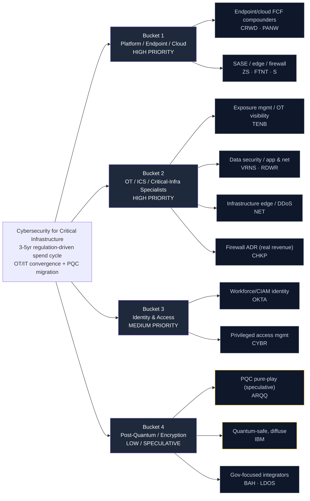

# Cybersecurity for Critical Infrastructure — Supply Chain Map

_Walks from the locked thesis (`thesis.md`) down to specific public companies. Four buckets matching the thesis priority ranking. Hand-curated. The three key dimensions per leaf node are **bottleneck / switching-cost specificity**, **real free-cash-flow today**, and **genuine critical-infrastructure exposure** — the second matters more here than in a pure-growth theme because the platform names carry premium multiples and the "great company, no margin of safety" risk is central._

**Knowledge cutoff caveat:** Drafted from data current through early 2026. The sector consolidates fast (Google/Wiz pending, ongoing platform M&A) — verify each ticker's current state during the `candidates.md` build. **Two items flagged for active research:** ARQQ's solvency / going-concern status (post-quantum RR question) and whether Microsoft's E5 bundle is measurably displacing independent-platform billings.

---

## The chain at a glance

_Yellow border = research / speculative — see Open Research Questions._

---

## Bucket 1 — Platform / Endpoint / Cloud Consolidators (HIGH PRIORITY)

**What it is:** The FCF-compounding platforms absorbing the security budget. Buyers are actively consolidating from dozens of point tools onto one console; the platforms with the best data gravity and cleanest free cash flow capture a growing share of a growing budget. This is where the thesis says the most *durable* value sits — real cash flow, not just growth.

**Bottleneck / switching-cost specificity:** High. Single-agent endpoint + module-attach economics create data-gravity lock-in; ripping out a platform means re-instrumenting every endpoint. The moat is the data lake and the operational muscle memory, not any single feature.

**Sales-cycle note:** Enterprise platform displacement is a 6-18 month cycle; once won, net-revenue-retention above 110% compounds for years.

### Sub-component: Endpoint / cloud FCF compounders

| Ticker | Company | Exposure | Note |
|--------|---------|----------|------|
| **CRWD** | CrowdStrike | Endpoint → cloud → identity → SIEM platform; strong FCF | The quality-compounder anchor. Falcon single-agent platform; best module-attach economics in the group. Premium multiple is the risk, not the business |
| **PANW** | Palo Alto Networks | Network → cloud (Prisma) → SecOps (XSIAM) "platformization" | The platformization playbook; real FCF; explicit strategy to consolidate the buyer's stack. Firewalls give it genuine OT/network adjacency into critical infra |

### Sub-component: SASE / edge / firewall

| Ticker | Company | Exposure | Note |
|--------|---------|----------|------|
| **ZS** | Zscaler | Zero-trust SASE / secure edge; cloud-delivered | Pure-play zero-trust edge; strong billings, improving FCF. Critical for OT/IT convergence (secures remote access into plants) |
| **FTNT** | Fortinet | Firewalls + genuine OT/ICS security franchise | **The real critical-infrastructure angle in this bucket.** FortiGate has a large embedded base in industrial / utility networks; profitable with real FCF. Its OT franchise is a genuine sticky-installed-base story, not a bolt-on |
| **S** | SentinelOne | Autonomous endpoint (Singularity) + data platform | The #2 endpoint challenger to CRWD. Faster growth but not yet consistently FCF-positive — held for platform optionality, penalized on capital structure |

---

## Bucket 2 — OT / ICS / Critical-Infrastructure Specialists (HIGH PRIORITY)

**What it is:** The names with the most genuine exposure to physical infrastructure — exposure management, network/application security, data security, and the infrastructure edge. This is where the "sticky installed base inside a substation / refinery / SCADA system" moat lives. The purest OT pure-plays (Dragos, Claroty) are private, so this bucket is expressed through the closest holdable proxies.

**Switching-cost specificity:** Very high where the product is embedded in a validated control system (re-certifying a safety case to swap vendors is a multi-year project); lower for the more general network/data-security names.

### Sub-component: Exposure management / OT visibility

| Ticker | Company | Exposure | Note |
|--------|---------|----------|------|
| **TENB** | Tenable | Vulnerability / exposure management incl. OT (Tenable OT / Nessus) | The closest holdable proxy to a pure OT-visibility play. Tenable OT Security has real industrial footprint; profitable-ish with modest FCF. Sticky in critical-infra asset inventories |

### Sub-component: Data security / application & network security

| Ticker | Company | Exposure | Note |
|--------|---------|----------|------|
| **VRNS** | Varonis | Data security / DSPM; SaaS transition | Data-centric security; sticky where sensitive data governance is mandated (utilities, healthcare). Mid-transition to SaaS — watch FCF during the shift |
| **RDWR** | Radware | Application / DDoS / network security | Protects the network layer that critical-infra web/app services depend on. Smaller, profitable, real cash flow; less glamorous but durable |

### Sub-component: Infrastructure edge / DDoS

| Ticker | Company | Exposure | Note |
|--------|---------|----------|------|
| **NET** | Cloudflare | Infrastructure edge, Zero Trust, DDoS, network security | The internet's edge; increasingly a security platform (Zero Trust, magic transit). Real critical-infra relevance as the edge that absorbs volumetric attacks. High multiple, improving FCF |

### Sub-component: Firewall ADR (real revenue)

| Ticker | Company | Exposure | Note |
|--------|---------|----------|------|
| **CHKP** | Check Point Software (ADR) | Firewalls / network security; highly profitable | Israeli firewall incumbent, liquid US-listed ADR. The "boring FCF machine" of the group — very high margins, strong buyback, modest growth. Balance-sheet-quality anchor |

---

## Bucket 3 — Identity & Access (MEDIUM PRIORITY)

**What it is:** The identity layer — the "new perimeter" once the network perimeter dissolves. Critical structurally (every zero-trust architecture is identity-first), but the market oscillates on multiples and OKTA carries breach-scar risk. Held for the structural role, not for a re-rating narrative.

**Switching-cost specificity:** High once identity is the central directory / PAM system of record — but the market prices it as contested (Microsoft Entra bundling pressures OKTA in particular).

### Sub-component: Workforce / CIAM identity

| Ticker | Company | Exposure | Note |
|--------|---------|----------|------|
| **OKTA** | Okta | Workforce + customer identity (CIAM) | Identity-as-perimeter leader; profitable on FCF now. Carries 2022-2023 breach-scar risk and Entra-bundle competition — held for structure, not narrative |

### Sub-component: Privileged access management

| Ticker | Company | Exposure | Note |
|--------|---------|----------|------|
| **CYBR** | CyberArk | Privileged access management (PAM) + machine identity | The PAM leader; directly relevant to critical infra (privileged control-system access is the crown-jewel attack surface). Strong growth, improving FCF; better-positioned than OKTA on competitive dynamics |

---

## Bucket 4 — Post-Quantum / Encryption Optionality (LOW / SPECULATIVE)

**What it is:** The NIST-PQC-standardization (Aug 2024, FIPS 203/204/205) migration cycle. Real but early — every long-lived encrypted system must eventually be re-keyed against harvest-now-decrypt-later adversaries. **The thesis explicitly says names here must be sized as immaterial optionality — the timeline is a decade and the pure-play vehicles are thin. We're betting on optionality, not cash flow.**

**Bottleneck specificity:** Very high in theory (few can build validated quantum-safe crypto), but commercial demand is mostly ahead of the procurement. ARQQ is a genuine pure-play but tiny and speculative; IBM's exposure is diffuse inside a mega-cap.

### Sub-component: PQC pure-play (speculative)

| Ticker | Company | Exposure | Note |
|--------|---------|----------|------|
| **ARQQ** | Arqit Quantum (ADR) | Symmetric-key / quantum-safe encryption pure-play | Genuine PQC pure-play but micro-cap and speculative — **sized as immaterial optionality only.** Solvency / going-concern is the open research question. Optionality on a PQC-mandate headline, not a core holding |

### Sub-component: Quantum-safe, diffuse (mega-cap)

| Ticker | Company | Exposure | Note |
|--------|---------|----------|------|
| **IBM** | IBM | Quantum-safe crypto + quantum computing + security services | Diffuse but real: IBM co-authored NIST PQC standards and sells quantum-safe migration services. Real FCF, but PQC is a tiny slice of a diversified mega-cap — held as diffuse optionality with a real balance sheet under it |

### Sub-component: Government-focused integrators (cross-theme)

| Ticker | Company | Exposure | Note |
|--------|---------|----------|------|
| **BAH** | Booz Allen Hamilton | Federal cyber + PQC migration services | Government-focused; will implement the federal PQC migration and critical-infra directives. Cross-theme with Space/Defense; small position, real FCF |
| **LDOS** | Leidos | Federal cyber + critical-infra IT services | Federal IT / cyber integrator with critical-infrastructure contracts. Cross-theme, small; cheap and cash-generative |

---

## Explicitly Excluded

| Name | Bucket it would fit | Why excluded |
|------|---------------------|--------------|
| **Wiz** | Cloud security (OT-adjacent) | Being acquired by Google — no independent public vehicle |
| **Dragos** | OT/ICS pure-play | Private — the cleanest OT-security pure-play, but not investable |
| **Claroty** | OT/ICS pure-play | Private — same problem; the other clean OT pure-play, not holdable |
| **Microsoft (MSFT)** | Platform (E5 bundle) | The "vehicles wrong" reference — captures security budget via bundling, but far too diluted to be a pure-play; tracked as a competitive threat, not a holding |
| **Various thin OTC "cyber" microcaps** | — | Thin OTC / unsponsored ADRs — fail the US-listed / liquid rule |

**Note on MSFT:** Listed as negative space, not a candidate. If Microsoft's security revenue accelerates while our independent platforms' billings decelerate, the "consolidation onto a mega-platform we don't own" falsifier is firing (see thesis.md).

---

## Bottleneck / switching-cost specificity ranking (1 = most replaceable, 5 = hardest to substitute)

| Name | Rating | Notes |
|------|--------|-------|
| CRWD (single-agent platform + data gravity) | **5** | Data-lake lock-in; re-instrumenting every endpoint to leave |
| FTNT (embedded OT/firewall base) | **5** | Genuine OT installed base inside industrial networks |
| CYBR (PAM system of record) | 4 | Privileged-access crown jewels; painful to swap |
| PANW (platformization + firewalls) | 4 | Module-attach lock-in + network position |
| TENB (OT asset inventory) | 4 | Embedded in critical-infra asset inventories |
| CHKP (firewall incumbent) | 4 | Deeply embedded firewalls; high switching cost, low growth |
| ZS (zero-trust edge) | 4 | Inline traffic dependency once deployed |
| NET (infrastructure edge) | 3 | Edge/DDoS is somewhat substitutable but sticky at scale |
| VRNS (data security) | 3 | Sticky where data governance is mandated; mid-SaaS-transition |
| OKTA (workforce identity) | 3 | Critical role but Entra-bundle-contested |
| S (challenger endpoint) | 3 | Real tech but #2 to CRWD; less data gravity |
| RDWR (app/DDoS) | 3 | Network-layer protection; competitive segment |
| IBM (diffuse quantum-safe) | 3 | Real capability, tiny slice of a mega-cap |
| BAH / LDOS (federal integrators) | 3 | Procurement-framework moat rather than technical |
| ARQQ (PQC pure-play) | 4 if it survives | Genuine pure-play but micro-cap solvency risk dominates |

---

## Open research questions (for resolution before / during tracker maintenance)

1. **ARQQ solvency / going-concern.** Genuine PQC pure-play with a US-listed ADR, but micro-cap with a history of cash burn and dilution. If it fails the capital-structure bar (it almost certainly will), the post-quantum sub-bucket has *no* clean public pure-play and PQC is expressed only diffusely through IBM. Size as immaterial optionality regardless.

2. **Microsoft E5-bundle displacement.** Is Microsoft measurably taking critical-infra security budget from the independent platforms via bundling, or is best-of-breed still winning? This is the formal "consolidation onto a mega-platform we don't own" falsifier — needs tracking in CRWD/PANW/ZS billings commentary.

3. **FTNT OT-franchise durability.** FTNT is the cleanest OT angle among the profitable platforms. Confirm the OT/industrial segment growth is holding and that the firewall refresh cycle is not masking core deceleration.

4. **Regulatory enforcement trajectory.** TSA/CISA directives and SEC disclosure enforcement are the demand floor. Watch for any deregulatory rollback (a named thesis falsifier).

5. **CHKP as balance-sheet anchor vs. growth drag.** CHKP is the FCF/buyback anchor but grows slowly. Confirm it earns a tracker spot on capital-structure quality, not on growth — and that it isn't structurally losing share to the platforms.

---

_Next step: seed `_universe.json` via `_seed_from_universe.py`, then `_score_run.py` applies the long-only rubric and shortlists the tracker._
