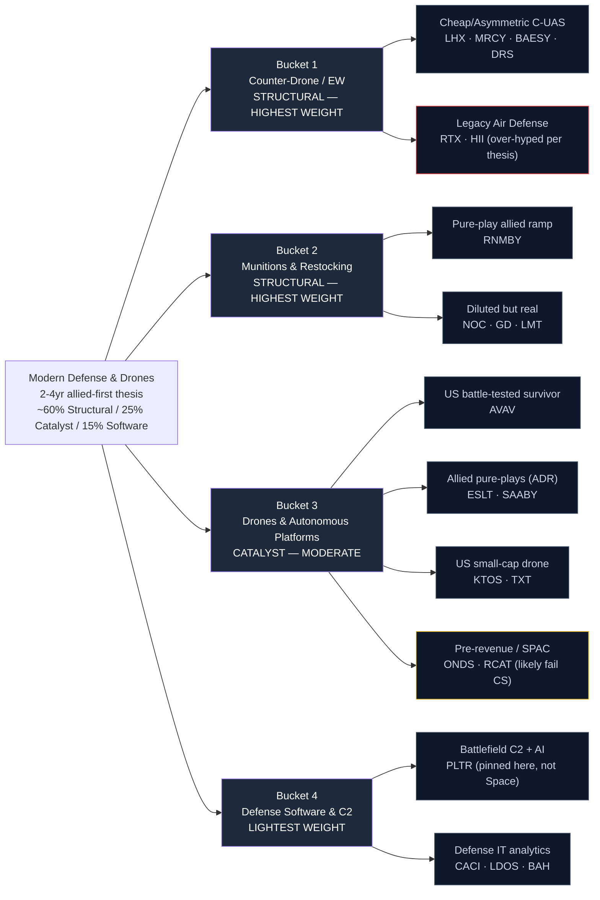

# Modern Defense & Drones — Supply Chain Map

_Walks from the locked thesis (`thesis.md`) down to specific public companies. Four buckets matching the thesis priority ranking, with tracker position weight skew explicit: ~60% Buckets 1+2 (structural holds), ~25% Bucket 3 (catalyst trades), ~15% Bucket 4 (software). Hand-curated. Capital structure + real-revenue-today are critical because vehicles-wrong is a real risk._

**Cross-theme overlap note:** Several names (LHX, MRCY, BAESY, NOC, KTOS, CACI, BAH, LDOS) appear in both Space Economy and Modern Defense candidate universes — they have legitimate exposure to both themes. At tracker-init time we'll explicitly handle whether any of these should be held in both trackers (= effective 2x position) or only one. PLTR is already pinned to Defense only per thesis.

**Knowledge cutoff caveat:** Drafted from data current through early 2025. Defense sector consolidation and small-cap dilution patterns evolve rapidly — verify each ticker's current state during scoring.

---

## The chain at a glance

_Red border = over-hyped per thesis. Yellow border = research / speculative._

---

## Bucket 1 — Counter-Drone / Electronic Warfare (HIGHEST WEIGHT — STRUCTURAL)

**What it is:** The defensive layer that makes cheap drone swarms survivable to operate against. The thesis says the most under-priced sub-category is **non-kinetic** counter-drone — HPM, directed energy, EW jamming — because the math of $2K drone vs. $2M missile only works for the attacker. We **explicitly downgrade** the legacy kinetic side (RTX Patriot, HII ship-based) even though it's a defense growth story — those systems are what the thesis says is rendered obsolete.

**Bottleneck specificity:** Mixed. EW + HPM/DE are specialized with few qualified suppliers but the best of those (Epirus, Anduril) are private. Among public names, LHX has the most direct EW pure-play exposure.

### Sub-component: Cheap / Asymmetric C-UAS

| Ticker | Role | Bottleneck specificity | Cross-theme? |
|--------|------|------------------------|--------------|
| **LHX** (L3Harris) | Tactical EW + space comms; defense prime with clean balance sheet | **4** — most EW pure-play of the primes | Also in Space tracker |
| **MRCY** (Mercury Systems) | Rad-hard edge compute for autonomous systems + C-UAS sensor fusion | 4 — specialized | Also in Space tracker |
| **BAESY** (BAE Systems ADR) | UK defense prime — EW + targeting + radar | 3 — diluted but real | Also in Space tracker |
| **DRS** (Leonardo DRS) | US arm of Leonardo — counter-UAS + force protection + ISR. Smaller pure-play exposure | 4 — narrower focus, real revenue | Defense-only |

### Sub-component: Legacy Air Defense (downgraded per thesis)

| Ticker | Role | Why flagged |
|--------|------|-------------|
| **RTX** (RTX Corp) | Patriot, NASAMS, broad missiles + commercial aero | Thesis explicitly says kinetic interceptors against cheap drones are uneconomic — **expected to underperform pure-play CUAS** |
| **HII** (Huntington Ingalls) | Submarine + surface combatant shipbuilder; ship-based defense | Diluted into legacy shipbuilding; thesis-misaligned |

Included for completeness and as the "vehicles wrong" reference for this bucket. Likely to be scored low on theme exposure / RS inflection.

---

## Bucket 2 — Munitions & Restocking (HIGHEST WEIGHT — STRUCTURAL)

**What it is:** 155mm artillery shells, propellants, smart munitions — the multi-year-locked-backlog cohort. The most insulated names from a ceasefire-driven drawdown because allied stockpiles need to refill regardless of active conflict. **Highest weight in the tracker by design** because backlogs protect through the geopolitical-sensitivity risk.

**Bottleneck specificity:** Very high. Munitions manufacturing capacity is hard to add quickly — propellant chemistry, casing forging, and quality testing are all gated. Rheinmetall is the cleanest pure-play; US primes are diluted but have real exposure.

### Sub-component: Pure-play allied ramp

| Ticker | Role | Bottleneck specificity |
|--------|------|------------------------|
| **RNMBY** (Rheinmetall ADR) | German artillery + 155mm shells + propellants. **Massive Europe restocking ramp.** The thesis flagship pure-play | **5** — dominant European supplier with multi-year backlogs |

### Sub-component: Diluted but real

| Ticker | Role | Bottleneck specificity |
|--------|------|------------------------|
| **NOC** (Northrop Grumman) | Strategic systems + B-21 + propellants + ammo. Already in Space tracker | 4 within the munitions slice; otherwise diluted |
| **GD** (General Dynamics) | Abrams tanks + Stryker + ordnance + submarines + IT | 3 — broad portfolio dilutes |
| **LMT** (Lockheed Martin) | F-35 + Javelin + HIMARS + GMLRS. **Also our vehicles-wrong reference name** | 3 — legacy aero + F-35 dominate the revenue mix |

---

## Bucket 3 — Drones & Autonomous Platforms (MODERATE WEIGHT — CATALYST)

**What it is:** The headline trade. Pure-play drone makers riding US contract awards (Replicator, DDP) and allied procurement (Europe, Israel, Indo-PACOM). The thesis treats this as a **catalyst trade** — harvest aggressively into spikes, don't size for buy-and-hold. The cohort is split between battle-tested survivors (AVAV) and SPAC-burns (ONDS, RCAT).

**Bottleneck specificity:** Mixed — fielded designs with DoD revenue (AVAV's Switchblade) have real moats; SPAC-stage drone startups have minimal.

### Sub-component: US battle-tested survivor

| Ticker | Role | Bottleneck specificity |
|--------|------|------------------------|
| **AVAV** (AeroVironment) | Switchblade loitering munitions (fielded extensively in Ukraine), Puma sUAS, Jump 20. **The one battle-tested US pure-play with massive fielded DoD revenue.** Thesis explicitly exempts from over-hype category | **4** — proven product-market fit with real combat data |

### Sub-component: Allied pure-plays (ADR)

| Ticker | Role | Bottleneck specificity |
|--------|------|------------------------|
| **ESLT** (Elbit Systems ADR) | Israeli — ISR drones, Hermes UAVs, EW systems, ground systems. Battle-tested, multi-customer | **4** — high allied-buyer concentration matches thesis |
| **SAABY** (Saab ADR) | Swedish — anti-armor (NLAW, Carl-Gustaf), Gripen fighter, Giraffe radar. Europe rearmament beneficiary | 4 — Europe-pure-play |

### Sub-component: US small-cap drone

| Ticker | Role | Bottleneck specificity |
|--------|------|------------------------|
| **KTOS** (Kratos Defense) | Target drones + Valkyrie (XQ-58) loyal wingman + tactical drones. Already in Space tracker | 3 — narrower customer base, growing fast |
| **TXT** (Textron) | Bell helicopters + AAI Corp Shadow drones + Cessna. **Diluted exposure** | 2 — drones are small slice of diversified industrial |

### Sub-component: Pre-revenue / SPAC (likely to fail CS bar)

These are flagged here for completeness but the "real revenue today" mandate plus capital_structure criterion will probably reject both at scoring. Worth tracking on a watch list.

| Ticker | Status | Why flagged |
|--------|--------|-------------|
| **ONDS** (Ondas Holdings) | Pre-profitable, persistent dilution. Has Replicator program participation | Real defense interest but capital intensity outpaces |
| **RCAT** (Red Cat Holdings) | Small drone manufacturer, recently won SRR Tranche 2 | Real but small revenue; heavy dilution to scale |

---

## Bucket 4 — Defense Software & C2 (LIGHTEST WEIGHT — 15%)

**What it is:** Battlefield command-and-control, intelligence analytics, mission systems. The thesis recognizes this layer matters but de-prioritizes it because (a) Anduril Lattice is the dominant player and private, and (b) most public-market "AI defense" pure-plays are over-hyped per the thesis.

### Sub-component: Battlefield C2 + AI

| Ticker | Role | Bottleneck specificity |
|--------|------|------------------------|
| **PLTR** (Palantir) | Foundry for defense — Maven program (image analysis for targeting), DoD-wide C2, NRO contracts. **Pinned here in Defense only, not Space** per thesis | 3 — broad applicability; valuation is the main constraint |

### Sub-component: Defense IT analytics

| Ticker | Role | Bottleneck specificity |
|--------|------|------------------------|
| **CACI** (CACI International) | Defense IT, intelligence community, EW services. Already in Space tracker | 3 — also flagged for acquisition-funded debt growth |
| **LDOS** (Leidos) | Largest defense IT contractor. Already in Space candidate universe | 3 — diluted but high quality |
| **BAH** (Booz Allen Hamilton) | Government consulting + mission support. Already in Space tracker | 3 — cleanest BS of the three, also flagged for debt growth |

---

## Cross-bucket notes

### Cross-theme overlap (Space ↔ Defense)

| Ticker | Currently in Space tracker? | Notes |
|--------|------------------------------|-------|
| **LHX** | YES (Space slot #1) | Highest CS in Space cohort; equally compelling for Defense EW |
| **MRCY** | YES (Space slot #3) | Rad-hard chips serve both space and edge-defense compute |
| **BAESY** | YES (Space slot #5) | European defense prime serving both themes |
| **NOC** | YES (Space slot #4) | In-orbit servicing for Space; propellants for Defense |
| **KTOS** | Candidate (Space) | Small sats + tactical drones |
| **CACI** | YES (Space slot #6, Lean Trim) | Defense IT serves both |
| **BAH** | YES (Space slot #7) | Same logic |
| **LDOS** | Candidate (Space) | Defense IT |

**Tracker-init policy needed:** At Modern Defense scoring time, we need to decide whether any names already in Space tracker should also enter Defense tracker (resulting in effective 2x position sizing). My recommendation: **prefer Defense-pure names where the score is within 2 normalized points**, and explicitly flag any name that ends up in both trackers so position sizing accounts for it.

### Bottleneck specificity ranking (1 = most replaceable, 5 = hardest to substitute)

| Sub-component | Rating | Notes |
|---------------|--------|-------|
| RNMBY (artillery / 155mm shells) | **5** | Dominant European supplier with multi-year backlogs |
| LHX (tactical EW) | 4 | Most EW pure-play among primes |
| MRCY (rad-hard edge compute) | 4 | Specialized, ~5 global competitors |
| AVAV (Switchblade fielded) | 4 | Real combat data + DoD revenue moat |
| DRS (counter-UAS pure-play) | 4 | Narrower focus, US arm of Leonardo |
| ESLT (Israeli ISR + EW) | 4 | Battle-tested, multi-customer |
| SAABY (Europe anti-armor) | 4 | Europe-pure-play |
| BAESY (UK EW + radar) | 3 | Diluted but real |
| NOC, GD, LMT (US munitions) | 3 | Diluted by legacy programs |
| KTOS (target drones + Valkyrie) | 3 | Smaller customer base |
| PLTR (battlefield C2) | 3 | Valuation-constrained |
| CACI / LDOS / BAH (defense IT) | 3 | Procurement-framework moat |
| TXT (Bell + drones diluted) | 2 | Drones small slice |
| RTX, HII (legacy air defense) | 2 | Thesis-misaligned |
| ONDS, RCAT (SPAC drones) | 2 | Pre-revenue / dilution |

### Where the "thesis right, vehicles wrong" risk concentrates

This is meaningful for Defense (rated medium-high). Specific concentrations:

1. **Anduril stays private.** Best-positioned drone + Lattice C2 company captures upside privately. The only mitigation: own AVAV (the public proxy with real revenue) and accept the suboptimal vehicle.
2. **Epirus stays private.** HPM/DE counter-drone leader. We express through diluted LHX / BAESY / RTX exposure.
3. **Defense primes absorb best public pure-plays.** Same risk pattern as Space — falsifier triggers if 2+ top 5 tracker names get acquired below 40% premium.
4. **Pre-revenue drone SPACs never reach scale.** ONDS, RCAT, similar names. Capital structure criterion correctly demotes them at scoring.

### Where the thesis is most concentrated (single-name dependence)

- **RNMBY** is the flagship pure-play munitions ramp — likely highest-conviction tracker candidate. The single-name dependency is real; if RNMBY had idiosyncratic governance issues, the munitions sub-thesis loses its cleanest expression.
- **LHX** does triple duty (already in Space, candidate for Defense, also our EW pure-play). If we end up holding LHX in both Space and Defense trackers, it's our biggest concentration risk across the portfolio.
- **AVAV** is the only US drone pure-play that passes the thesis bar — concentration risk inside the drone catalyst trade.

---

## Open research questions (for resolution before tracker lock)

1. **Cross-theme position sizing policy.** Decide explicitly: if LHX scores top-7 in both Space and Modern Defense, do we hold it 2x or pick one tracker? My recommendation is to allow the 2x but document it clearly so portfolio rebalancing accounts for it.

2. **DRS (Leonardo DRS) capital structure check.** Smaller cap counter-UAS pure-play with real US Army contracts. Need to confirm its CS is clean before promoting to tracker.

3. **RHM.DE vs RNMBY ADR liquidity.** Rheinmetall's primary listing is in Frankfurt (RHM.DE). The ADR (RNMBY) is the US-accessible vehicle. Verify ADR liquidity in Fidelity for any position sizing >$50K — if illiquid, consider direct foreign-share access.

4. **AVAV 13F concentration.** AVAV has had volatile fund ownership patterns post-Switchblade ramp. Confirm via tracker_live.json refresh whether key hedge funds are accumulating or distributing.

5. **TXT (Textron) revenue breakdown.** Bell helicopters + AAI Corp Shadow drones + Cessna + Beechcraft. What % is actually drone-relevant vs commercial aero / general aviation? If <10% drone, drop from candidates.

---

_Next step: extend `themes/refresh_data.py` UNIVERSES dict with the 21 candidate tickers, trigger daily refresh on Railway, then write `_score_run.py` for Defense (CS weight 20 like Space, given vehicles-narrow + geopolitical-sensitivity risks) and score the cohort._
