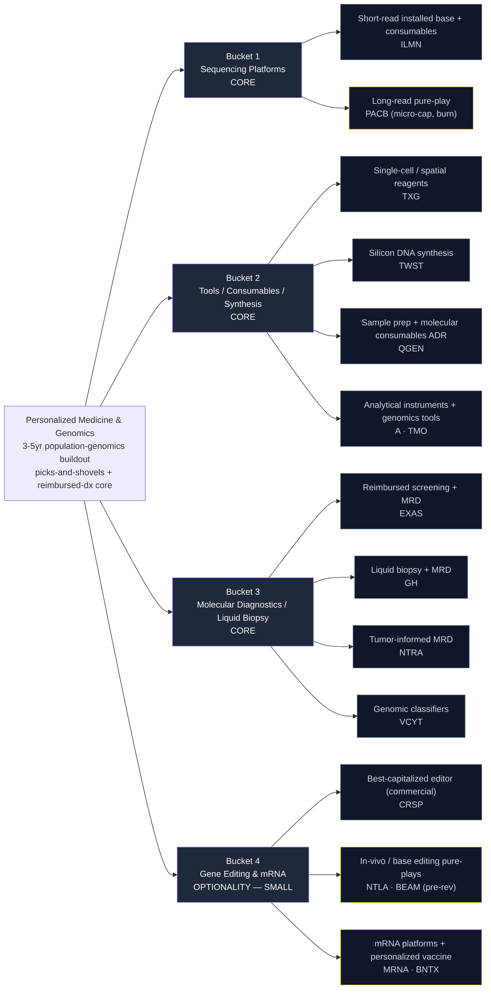

# Personalized Medicine & Genomics — Supply Chain Map

_Walks from the locked thesis (`thesis.md`) down to specific public companies. Four buckets, ordered by the thesis priority ranking: three "core" real-revenue buckets, then a deliberately-small optionality sleeve. Hand-curated. The three key dimensions per leaf node are bottleneck specificity, real-revenue presence, and capital-structure quality — the third matters heavily here because the "exciting-but-binary editors crowd out the durable arms dealers" risk is the central discipline of this theme._

**Knowledge cutoff caveat:** Drafted from data current through early 2026. The genomics sector moves fast on reimbursement decisions and clinical readouts — verify each ticker's coverage status and cash runway during the `candidates.md` build. **Two specific items flagged for active research:** current CMS/private-payer coverage breadth for MRD (Signatera) and blood-based screening (Shield), and the cash-runway/dilution cadence of each pre-revenue editor.

---

## The chain at a glance

_Yellow border = speculative / pre-revenue — see Explicitly Excluded and the optionality caveats._

---

## Bucket 1 — Sequencing Platforms (CORE)

**What it is:** The instruments that read DNA, and — far more importantly — the proprietary reagent consumables those instruments pull through for the life of the installed base. The sub-$200 genome is enabled here. Razor/razorblade economics: sequencers sell once, reagents sell forever.

**Bottleneck specificity:** High for the dominant short-read platform (locked-in installed base + proprietary consumables); moderate for long-read challengers where the tech is differentiated but the commercial base is small.

| Ticker | Company | Exposure | Note |
|--------|---------|----------|------|
| **ILMN** | Illumina | Dominant short-read sequencers (NovaSeq X) + consumable pull-through | **5** — the picks-and-shovels anchor; installed-base moat, but GRAIL/antitrust and execution history are the watch item |
| **PACB** | Pacific Biosciences | Long-read HiFi sequencing (Revio) | **4 on tech, but** micro-cap and cash-burning — real differentiation, speculative equity; optionality within the core bucket |

---

## Bucket 2 — Tools / Consumables / Synthesis (CORE)

**What it is:** The arms dealers. Reagents, single-cell and spatial kits, synthesized DNA, sample prep, and analytical instruments that *every* genomics lab, therapy developer, and diagnostics franchise depends on — regardless of which platform or therapy ultimately wins. The most durable, thesis-agnostic layer.

**Bottleneck specificity:** Mixed but structurally high at the specialized ends — silicon DNA synthesis and single-cell/spatial reagents have few qualified suppliers; broad analytical-instrument names are more diffuse but extremely durable.

| Ticker | Company | Exposure | Note |
|--------|---------|----------|------|
| **TWST** | Twist Bioscience | Silicon-based DNA synthesis + NGS panels | **5** — hard-to-substitute upstream input for synbio and NGS; still pre-profit, so priced on growth |
| **TXG** | 10x Genomics | Single-cell + spatial reagent consumables | **4** — recurring reagent franchise; IP-litigation and growth-deceleration overhang |
| **QGEN** | Qiagen (ADR) | Sample-to-insight consumables + QuantiFERON | **4** — sponsored NYSE ADR, real FCF, defensive consumables annuity |
| **A** | Agilent Technologies | Analytical instruments + genomics reagents | **3** — diversified, durable FCF, diluted theme purity; quality ballast |
| **TMO** | Thermo Fisher Scientific | Instruments + reagents (broad picks-and-shovels) | **3** — sells to every genomics lab; diffuse but safe, real revenue + margins |

---

## Bucket 3 — Molecular Diagnostics / Liquid Biopsy (CORE)

**What it is:** The reimbursed, recurring, insurer-paid clinical franchises — cancer screening, molecular residual disease (MRD) monitoring, liquid biopsy, and genomic classifiers. Real revenue today, compounding on test volume rather than a single clinical readout. The reimbursement + guideline + workflow moat is a toll road, not a commodity lab test.

**Bottleneck specificity:** Moderate-to-high. The technical assay is replicable; the durable moat is the reimbursement coverage, guideline inclusion, and clinician-workflow embedding that takes years and capital to build.

| Ticker | Company | Exposure | Note |
|--------|---------|----------|------|
| **EXAS** | Exact Sciences | Reimbursed screening (Cologuard) + Oncodetect MRD | **4** — flagship real-revenue screening scale; blood-based screening is the next TAM leg _(did not price via yfinance at lock — record at FMP refresh)_ |
| **GH** | Guardant Health | Liquid biopsy (Guardant360) + Shield blood screening + MRD | **4** — liquid-biopsy volume compounding; Shield reimbursement is the swing factor |
| **NTRA** | Natera | Tumor-informed MRD (Signatera) + reproductive | **4** — category-leading MRD compounding ~40% YoY on a large proprietary dataset |
| **VCYT** | Veracyte | Genomic classifiers (Decipher, Afirma) | **3** — reimbursed and profitable, but narrower TAM than GH/NTRA |

---

## Bucket 4 — Gene Editing & mRNA (OPTIONALITY — SMALL)

**What it is:** The therapeutics layer — in-vivo and ex-vivo CRISPR editing, base editing, and mRNA platforms including individualized cancer vaccines. The long-term prize is enormous, but as equities these are pre-revenue or revenue-cliff binary options financed by dilution. **The thesis explicitly caps this sleeve small: names here must be among the best-capitalized in the field to earn promotion, and we are buying optionality, not cash flow.**

**Bottleneck specificity:** Very high at the platform level (few players can do in-vivo editing or base editing at all), but commercial monetization is single-catalyst and mostly aspirational.

| Ticker | Company | Exposure | Note |
|--------|---------|----------|------|
| **CRSP** | CRISPR Therapeutics | Ex-vivo + in-vivo CRISPR; Casgevy approved/commercial | **4** — best-capitalized editor with an approved product + large cash runway; the anchor of the optionality sleeve |
| **BNTX** | BioNTech (ADR) | mRNA individualized cancer immunotherapy | **3** — strong balance sheet, sponsored NASDAQ ADR; revenue cliff vs. pipeline optionality |
| **MRNA** | Moderna | mRNA platform + INT personalized cancer vaccine (w/ Merck) | **3** — large cash pile but post-COVID revenue cliff; INT is the optionality |
| **NTLA** | Intellia Therapeutics | In-vivo CRISPR (NTLA-2001/2002) | **4 on platform, but** clinical-stage, dilutive; binary catalyst risk — smallest sizing |
| **BEAM** | Beam Therapeutics | Base editing | **4 on platform, but** pre-revenue, cash-burning — optionality only |

---

## Explicitly Excluded

Names deliberately left out of the candidate universe, with the reason:

| Ticker / Name | Category | Why excluded |
|---------------|----------|--------------|
| **VERV** (Verve Therapeutics) | In-vivo editing | **Acquired by Eli Lilly (completed 2025) — no longer independently listed/tradable.** Was on the seed list; removed. Its takeout is itself a data point (pharma absorbing the best-capitalized editors — a thesis falsifier to watch). |
| **ONT** (Oxford Nanopore, LON) | Sequencing platform | Foreign-only (London listing); not cleanly Fidelity-holdable as a liquid US line. **Benchmark-only** — a genuine long-read competitor to ILMN/PACB whose share gains are a re-check signal, but not an owned vehicle. |
| **23andMe / consumer genomics** | Consumer DTC | Consumer-curiosity TAM, not reimbursed recurring revenue; the thesis explicitly flags DTC genomics as over-hyped. |
| **Pre-revenue MCED-only pure-plays** | Multi-cancer early detection | Real science but pre-reimbursement and cash-burning; expressed instead through the reimbursed franchises (EXAS, GH) that are adding MCED/blood-screening as a leg rather than betting the company on it. |
| **Large-cap pharma / lab primes (LH, DGX, TMO-as-pharma)** | Diluted incumbents | LabCorp/Quest are diluted routine-lab exposure, not genomics-pure; TMO is kept only as a diffuse tools name, not a diagnostics bet. Big pharma is the *negative space* — if it acquires our dx names cheaply, that's the "absorbed before we capture upside" falsifier. |

---

## Where the thesis is most concentrated (single-name dependence)

- **ILMN** is the platform anchor — if its installed-base consumables moat cracks (open reagents, competitor share, or renewed antitrust distraction), Bucket 1 thins to a micro-cap (PACB) and the whole "sub-$200 genome" enabler leg weakens. This is the single largest concentration hazard.
- **GH + NTRA + EXAS** carry the reimbursed-dx pillar; a coordinated CMS coverage pullback would hit all three at once.
- **TWST** is the flagship "hard-to-substitute upstream synthesis" name — few substitutes, but pre-profit, so it carries valuation risk.

Worth treating as portfolio-construction notes in `scoring.md`: cap ILMN sizing given single-platform risk, and treat the Bucket 4 optionality sleeve as a *combined* small allocation rather than sizing each editor independently.

---

_Next step: `_universe.json` is seeded; `_score_run.py` applies the long-only rubric and shortlists the tracker._
