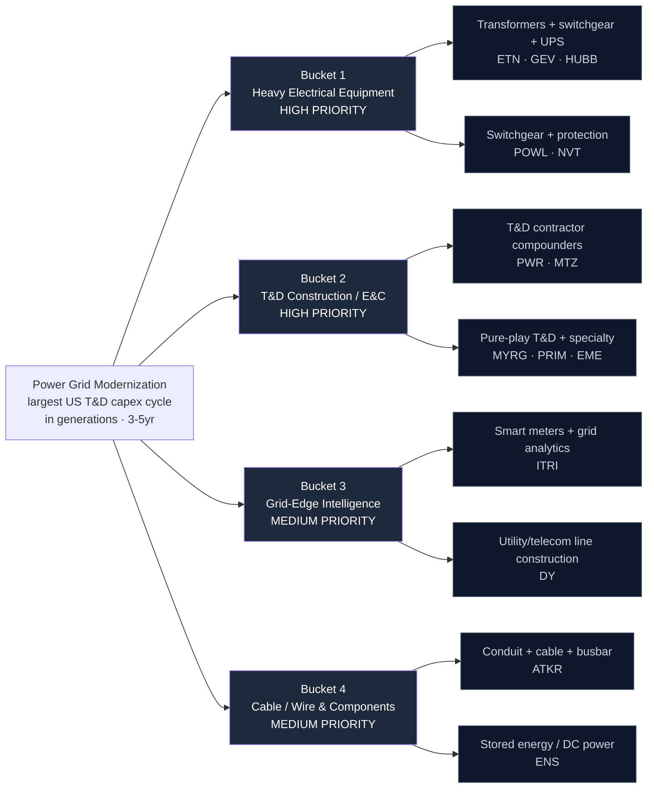

# Power Grid Modernization — Supply Chain Map

_Walks from the locked thesis (`thesis.md`) down to specific public companies. Four buckets matching the thesis priority ranking. Hand-curated. The three key dimensions per leaf node are **bottleneck specificity** (how hard-to-substitute the input), **backlog visibility** (multi-year order book = the earnings signal), and **valuation discipline** (several names have already re-rated on the AI-power narrative — paying a cyclical-peak price for a structural story is the central vehicles risk here)._

**Overlap caveat:** Several heavy-electrical names (ETN, GEV, HUBB, NVT, POWL, ATKR) are core to the AI Data Center theme. This theme is the **broader grid capex bet** and leans its incremental breadth into the T&D contractor cohort (PWR, MYRG, PRIM, MTZ, EME) and grid-edge (ITRI, DY) that AI DC does not carry. Where a name is shared, it earns its place here for the whole T&D cycle, not just the data-center-power slice.

---

## The chain at a glance

---

## Bucket 1 — Heavy Electrical Equipment (HIGH PRIORITY)

**What it is:** Large power and distribution transformers, high-voltage switchgear, circuit breakers, protective relays, UPS, and grid-scale power electronics. This is the physical bottleneck — the hardware whose multi-year lead times are the thesis's central catalyst. Oligopoly structure: a handful of global manufacturers, capacity that takes years to add, and a scarce core input (grain-oriented electrical steel).

**Bottleneck specificity:** High. Large power transformers are near-un-substitutable with multi-year lead times; switchgear and breakers are engineered-to-order with long qualification cycles. The pricing power the market keeps modeling as cyclical is structural for the duration of the cycle.

**Lead times:** Large power transformers multi-year (blown out from ~50 weeks); HV switchgear 40-80 weeks; even distribution transformers now carry multi-quarter backlogs.

### Sub-component: Transformers + switchgear + power management

| Ticker | Company | Exposure | Note |
|--------|---------|----------|------|
| **ETN** | Eaton | MV/HV switchgear, breakers, UPS, power management; direct T&D + data-center power | Flagship equipment anchor; massive backlogs, pricing power. Shared with AI DC — held here for the whole grid cycle |
| **GEV** | GE Vernova | Grid equipment (transformers, HVDC, grid orchestration) + power + wind | Purest large-scale grid-equipment maker; AI-power narrative darling — rich multiple, harvest-into-strength |
| **HUBB** | Hubbell | Utility T&D components, grid protection, connectors, metering-adjacent | Diversified but genuine utility-facing exposure; more T&D-levered than most equipment names |

### Sub-component: Switchgear + protection specialists

| Ticker | Company | Exposure | Note |
|--------|---------|----------|------|
| **POWL** | Powell Industries | Custom switchgear + electrical distribution for utility/industrial | Narrower customer base; re-rated hard on the power narrative — valuation discipline required |
| **NVT** | nVent Electric | Electrical enclosures, connection & protection, grid-hardening products | Component-level; solid but lower specificity. Shared with AI DC |

---

## Bucket 2 — T&D Construction / E&C Contractors (HIGH PRIORITY)

**What it is:** The specialized labor and project execution that physically builds transmission lines, substations, and distribution networks. Backlog is the earnings signal, but the deeper moat is the trained T&D workforce — linemen and high-voltage crews are the genuinely scarce resource. **This is the theme's incremental breadth vs AI Data Center** and, arguably, the cohort with the clearest labor-scarcity moat and the least valuation froth.

**Bottleneck specificity:** Medium-high. The service itself is substitutable in principle, but the trained crews and multi-year MSA relationships with utilities are not easily replicated. A contractor with the workforce AND the backlog to keep it busy compounds an advantage competitors can't buy quickly.

**Lead times / visibility:** Multi-year master service agreements and backlogs; book-to-bill above 1.0x with labor (not demand) as the binding constraint is the thesis-confirming signal.

### Sub-component: T&D contractor compounders

| Ticker | Company | Exposure | Note |
|--------|---------|----------|------|
| **PWR** | Quanta Services | The dominant US T&D construction contractor; transmission, substation, distribution, renewables interconnection | Flagship contractor anchor; largest backlog, deepest workforce. Re-rated but backlog justifies visibility |
| **MTZ** | MasTec | Power delivery (T&D), plus communications and pipeline infrastructure | Power-delivery segment growing fast; more diversified (some pipeline dilution) but real T&D leverage |

### Sub-component: Pure-play T&D + specialty E&C

| Ticker | Company | Exposure | Note |
|--------|---------|----------|------|
| **MYRG** | MYR Group | Near-pure-play T&D and commercial/industrial electrical construction | Smaller cap, cleanest T&D-construction pure-play; the highest-specificity contractor exposure |
| **PRIM** | Primoris Services | Utility + energy infrastructure construction; growing power-delivery mix | Diversified E&C with expanding utility exposure; backlog compounding |
| **EME** | EMCOR Group | Mechanical/electrical construction + facilities; grid-adjacent electrical build | Broad electrical construction; strong balance sheet and execution, more diluted grid exposure |

---

## Bucket 3 — Grid-Edge Intelligence (MEDIUM PRIORITY)

**What it is:** Smart meters, grid sensors, distribution automation, and the analytics that manage an increasingly distributed, bidirectional grid. "You can't manage what you can't measure" — as the grid absorbs distributed renewables, EVs, and two-way flows, the metering and edge-intelligence layer captures durable spend.

**Bottleneck specificity:** Medium. Smart-meter incumbency and utility software integration create switching-cost moats, but the hardware itself is more competitive than heavy equipment.

### Sub-component: Smart meters + grid analytics

| Ticker | Company | Exposure | Note |
|--------|---------|----------|------|
| **ITRI** | Itron | Smart meters, grid-edge intelligence, distribution automation, utility analytics | The cleanest grid-edge pure-play; recurring software mix growing. Not in AI DC — genuine incremental breadth |

### Sub-component: Utility & telecom line construction (edge buildout)

| Ticker | Company | Exposure | Note |
|--------|---------|----------|------|
| **DY** | Dycom Industries | Specialty contracting for telecom + increasingly utility/grid line construction | Primarily telecom/fiber but expanding utility line-construction exposure; grid-edge buildout proxy |

---

## Bucket 4 — Cable / Wire & Components (MEDIUM PRIORITY)

**What it is:** Conduit, cable, busbar, connectors, and stored-energy/DC-power components — higher-volume, lower-specificity exposure that scales directly with the tonnage of the buildout. The "commoditized but volume-levered" layer.

**Bottleneck specificity:** Lower. These are more fungible products, but volume exposure to the buildout is direct and the names are profitable with real balance sheets.

### Sub-component: Conduit + cable + busbar

| Ticker | Company | Exposure | Note |
|--------|---------|----------|------|
| **ATKR** | Atkore | Electrical conduit, cable, busbar — direct grid + data-center volume | Commoditized, cyclical pricing; high buildout-volume exposure. Shared with AI DC |

### Sub-component: Stored energy / DC power systems

| Ticker | Company | Exposure | Note |
|--------|---------|----------|------|
| **ENS** | EnerSys | Industrial stored-energy, DC power systems, grid-scale/backup batteries | Utility + telecom + grid-storage exposure; real revenue, reasonable valuation |

---

## Explicitly Excluded

Names deliberately left out of the candidate universe, with the reason:

| Ticker / Name | Category | Why excluded |
|---------------|----------|--------------|
| **Siemens Energy** (ENR.DE) | Heavy electrical | Foreign-only primary listing (Frankfurt); no clean high-volume US ADR — **benchmark-only** |
| **Schneider Electric** (SU.PA) | Heavy electrical | French listing; US ADR thin/unsponsored — **benchmark-only** |
| **Prysmian** (PRY.MI) | Cable / wire | Italian listing; the natural cable pure-play but not cleanly Fidelity-holdable — **benchmark-only** |
| **NEE** (NextEra) | Regulated utility | Spends the capex but earns capped rate-base ROE — captures the spend, not the equipment pricing power. **Benchmark, not core** |
| **AEP** (American Electric Power) | Regulated utility | Same regulated-ROE logic; a large transmission spender but the value accrues upstream. **Benchmark, not core** |
| Grid-storage / hydrogen SPACs | Speculative adjacency | Pre-revenue "grid of the future" names with narrative but no backlog or balance sheet; thesis explicitly flags as over-hype |
| **VRT** (Vertiv), **MOD** (Modine) | Data-center thermal/power | Core to AI Data Center theme; too data-center-specific vs the broad-grid bet — avoid double-counting |

---

## Cross-bucket notes

### Shared with AI Data Center (held here for the broader grid cycle)
- **ETN, GEV, HUBB, NVT, POWL, ATKR** all appear in AI DC's Heavy Electrical bucket. Here they represent the whole T&D capex cycle, not just data-center power. The incremental, non-overlapping breadth of this theme is the **contractor cohort (PWR, MTZ, MYRG, PRIM, EME)** and **grid-edge (ITRI, DY)**.

### Bottleneck specificity ranking (1 = most replaceable, 5 = hardest to substitute)

| Sub-component | Rating | Notes |
|---------------|--------|-------|
| Large power transformers / grid equipment (GEV, ETN) | **5** | Multi-year lead times, oligopoly, GOES-steel constrained |
| T&D contractor workforce (PWR, MYRG) | **4** | Trained crews + MSAs are the scarce resource, not the service |
| Custom switchgear (POWL) | 4 | Engineered-to-order, long qualification |
| Utility T&D components (HUBB) | 3 | Broad but genuinely utility-facing |
| Smart meters / grid-edge (ITRI) | 3 | Incumbency + software switching costs |
| Diversified E&C (MTZ, PRIM, EME) | 3 | Real T&D leverage, some non-grid dilution |
| Enclosures / protection (NVT) | 3 | Component-level, competitive |
| Stored energy (ENS) | 2 | Real exposure, more fungible |
| Line construction (DY) | 2 | Primarily telecom, expanding into utility |
| Conduit / cable / busbar (ATKR) | 2 | Commoditized, volume-levered, cyclical pricing |

### Where the vehicles-wrong risk concentrates
The risk here is **valuation, not existence**. GEV, PWR, and POWL have re-rated hard on the AI-power narrative — the discipline is to weight toward backlog-visibility names and treat the highest-flying multiples as harvest-into-strength positions. The contractor cohort (especially MYRG, MTZ, EME) carries the least froth and the clearest labor moat.

---

_Next step: `_universe.json` → seed real fundamentals → `_score_run.py` shortlists the tracker._
