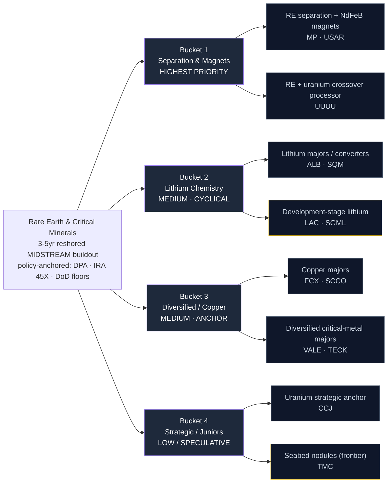

# Rare Earth & Critical Minerals — Supply Chain Map

_Walks from the locked thesis (`thesis.md`) down to specific public companies. Four buckets matching the thesis priority ranking. Hand-curated. The three key dimensions per leaf node are **bottleneck specificity** (is this the hard-to-substitute midstream step?), **funded/permitted status** (is the capacity real or announced?), and **capital structure** — the last matters most here because the "vehicles wrong" and "junior-explorer dilution" risks are central, not tail._

**Knowledge cutoff caveat:** Drafted from data current through early 2026. Critical-minerals policy is moving fast — DPA awards, IRA 45X mechanics, DoD equity/price-floor deals, and Chinese export controls all shift the picture. **Two specific items flagged for active research:** USA Rare Earth (USAR) magnet-plant commissioning / cash runway, and any second DoD price-floor deal beyond MP (would confirm the template is a program).

---

## The chain at a glance

_Yellow border = development-stage / speculative — see Explicitly Excluded and Open Research._

---

## Bucket 1 — Rare-Earth Separation & Magnets (HIGHEST PRIORITY)

**What it is:** The bottleneck itself. Chemical solvent-extraction separation of mixed rare-earth concentrate into individually purified oxides (NdPr, Dy, Tb), the metal/alloy step, and sintered NdFeB permanent-magnet manufacturing. This is the exact step China dominates (~85-90% of separation, the vast majority of magnets) and the exact step US/allied policy dollars — DPA Title III, IRA 45X per-kg credits, DoD price floors + offtake — are subsidizing. Highest specificity, highest conviction, but early monetization so capital structure is scrutinized hardest here.

**Bottleneck specificity:** Very high. Solvent-extraction trains are process-IP- and permit-gated, take years to commission, and there are only a handful of Western operators even attempting the full separation-to-magnet chain.

**Lead times:** Separation-train permitting + commissioning multi-year; magnet-plant qualification for a named OEM 18-36+ months.

### Sub-component: RE separation + NdFeB magnets (funded, policy-anchored)

| Ticker | Company | Exposure | Note |
|--------|---------|----------|------|
| **MP** | MP Materials | Mountain Pass mine + separation + Fort Worth magnet plant | **Flagship.** DoD 2025 equity stake + ~$110/kg NdPr price floor + 10-yr magnet offtake. The "what we actually want" reference — funded, permitted, offtake-backed midstream. Specificity **5** |
| **USAR** | USA Rare Earth | Stillwater magnet plant + Round Top HREE resource | Pure-play magnet + heavy-RE. Funded but early; commissioning + cash runway is the key research item. Specificity **5** if it clears qualification |

### Sub-component: RE + uranium crossover processor

| Ticker | Company | Exposure | Note |
|--------|---------|----------|------|
| **UUUU** | Energy Fuels | White Mesa mill: uranium + RE separation (monazite) | Only US mill with both uranium and operating RE-separation capability. Diluted by uranium/vanadium but real separation optionality. Specificity **4** |

---

## Bucket 2 — Lithium Chemistry & Conversion (MEDIUM PRIORITY — CYCLICAL)

**What it is:** Lithium mining and conversion to battery-grade hydroxide/carbonate. Real assets and (for the majors) real revenue, but returns are dominated by lithium spot price, not reshoring policy. Treat as cyclical exposure — size and time accordingly rather than holding as a pure policy play.

**Bottleneck specificity:** Moderate. Conversion chemistry has a moat, but lithium resource is comparatively abundant and the commodity-price whipsaw dominates equity returns.

**Lead times:** Conversion plant build 2-4 years; new mine to first production 4-7 years.

### Sub-component: Lithium majors / converters (real revenue)

| Ticker | Company | Exposure | Note |
|--------|---------|----------|------|
| **ALB** | Albemarle | Global lithium major + conversion | Largest, most diversified; real cash flow but full commodity-price whipsaw. Benchmark anchor. Specificity **3** |
| **SQM** | Sociedad Química y Minera (ADR) | Atacama brine lithium + specialty chemicals | Lowest-cost brine producer; Chilean political/royalty overhang. Specificity **3** |

### Sub-component: Development-stage lithium (higher risk)

| Ticker | Company | Exposure | Note |
|--------|---------|----------|------|
| **LAC** | Lithium Americas | Thacker Pass (Nevada) — largest US lithium resource | US DOE loan + GM offtake; pre-major-revenue, ramp + capital-structure risk. Specificity **4** on the US-resource angle |
| **SGML** | Sigma Lithium | Grota do Cirilo (Brazil) hard-rock spodumene | Low-cost producer, early revenue, persistent takeover chatter. Specificity **3** |

---

## Bucket 3 — Diversified / Copper & Base-Critical (MEDIUM PRIORITY — ANCHOR)

**What it is:** Copper and diversified critical-metal majors. Copper is the backbone metal of electrification, EVs, robotics, and AI-datacenter power — structural demand independent of the RE-magnet story. These are balance-sheet anchors: real cash flow, lower single-name blow-up risk, but diluted reshoring specificity.

**Bottleneck specificity:** Lower on the reshoring axis (copper isn't the China-monopoly step), but high on structural demand. These names anchor the sleeve rather than express the pure thesis.

**Lead times:** New copper mine 7-10+ years — supply is structurally tight, which is the demand-side case.

### Sub-component: Copper majors

| Ticker | Company | Exposure | Note |
|--------|---------|----------|------|
| **FCX** | Freeport-McMoRan | Global copper major (+ gold, moly) | Largest liquid US-listed copper pure-play; leveraged to electrification demand. Specificity **4** on copper-demand axis |
| **SCCO** | Southern Copper | Low-cost Peru/Mexico copper, huge reserves | Lowest-cost, longest-reserve-life copper; Grupo México control overhang. Specificity **4** |

### Sub-component: Diversified critical-metal majors

| Ticker | Company | Exposure | Note |
|--------|---------|----------|------|
| **VALE** | Vale (ADR) | Iron ore + nickel + copper | Nickel/copper give critical-metal exposure; iron ore dominates. Cheap, high-yield, Brazil risk. Specificity **3** |
| **TECK** | Teck Resources | Copper (post-coal-spin) + zinc | Transformed into a copper-growth story (QB2 ramp); clean-ish diversified base-metals. Specificity **3** |

---

## Bucket 4 — Strategic Overlap & Juniors (LOW / SPECULATIVE)

**What it is:** Uranium strategic anchor, seabed-nodule frontier sourcing, and (conceptually) junior explorers. The most speculative bucket — most monetization is either well-understood-but-adjacent (uranium) or a decade out (nodules). **The thesis explicitly says: names here must clear a higher capital-structure bar or be sized as small speculative sleeves.**

**Bottleneck specificity:** Bimodal — uranium fuel-cycle is a real strategic bottleneck with cash flow (CCJ); seabed nodules are extreme-specificity optionality with extreme regulatory/technical risk (TMC).

### Sub-component: Uranium strategic anchor (real cash flow)

| Ticker | Company | Exposure | Note |
|--------|---------|----------|------|
| **CCJ** | Cameco | Largest Western uranium producer + fuel services | Strategic-mineral overlap (nuclear fuel cycle) with real revenue; benefits from same "reshore the strategic supply chain" policy tailwind. Specificity **4** |

### Sub-component: Seabed nodules — frontier sourcing (speculative)

| Ticker | Company | Exposure | Note |
|--------|---------|----------|------|
| **TMC** | TMC the metals company | Polymetallic seabed nodules (Ni/Co/Cu/Mn) | Pure optionality — decade of regulatory/environmental/technical risk before commercial output. Small speculative sleeve only. Specificity **5** if it ever clears, but failure risk extreme |

---

## Explicitly Excluded

Names deliberately left out of the investable universe, with the reason:

| Ticker / Name | Why excluded |
|---------------|--------------|
| **Lynas Rare Earths (LYC.AX)** | The largest non-China separator — the single best pure-play beneficiary — but **Australia-only listing**, no clean US-holdable line. **Benchmark-only** as the "vehicles wrong" reference: if LYC.AX outperforms our US-listed picks, the value is being captured outside our investable set. |
| **Iluka Resources (ILU.AX)** | Building an Australian RE refinery with government backing — real midstream — but **foreign-only listing**. Benchmark-only. |
| **Arafura Rare Earths (ARU.AX)** | Australian NdPr project with offtake, but foreign-only and pre-production. Benchmark-only. |
| **Solvay / private separators** | Real European separation capacity but not a clean single-name equity vehicle. |
| **Junior US/Canadian explorers (generic)** | Drill-result-and-a-dream micro-caps with no processing, permit, or offtake. Fail the capital-structure bar; a small speculative sleeve at most, not promoted. |

**Note on TMC placement:** TMC is kept *in* the universe (Bucket 4) as the operator explicitly flagged it optional; it is scored as a small speculative sleeve and will fail the capital-structure screen — included for completeness and optionality tracking, not as a promotion candidate.

---

## Cross-bucket notes

### Names that span multiple buckets

- **UUUU (Energy Fuels):** Bucket 1 (RE separation) + Bucket 4 conceptual overlap (uranium fuel cycle). The only US mill doing both — genuine crossover.
- **MP / USAR:** Bucket 1 spans both mining and midstream — but the thesis value is the midstream (separation + magnets), not the mine.
- **CCJ (Cameco):** Bucket 4 strategic overlap; also the cleanest "reshore the strategic fuel cycle" cash-flow name.

### Bottleneck specificity ranking (1 = most replaceable, 5 = hardest to substitute on the reshoring axis)

| Name | Rating | Notes |
|------|--------|-------|
| MP (separation + magnets + DoD floor) | **5** | Funded, permitted, offtake-backed full chain — the flagship |
| USAR (magnets + HREE) | **5** | Pure-play magnet + heavy-RE if it clears qualification |
| TMC (seabed nodules) | **5** | Extreme specificity but extreme failure risk |
| UUUU (RE + uranium separation) | 4 | Only US mill doing both |
| LAC (largest US lithium resource) | 4 | US-resource + DOE loan + GM offtake |
| FCX / SCCO (copper majors) | 4 | High on copper-demand axis, lower on reshoring axis |
| CCJ (uranium fuel cycle) | 4 | Strategic overlap with real cash flow |
| ALB / SQM (lithium majors) | 3 | Real revenue but commodity-price-dominated |
| SGML (hard-rock lithium) | 3 | Early revenue, cyclical |
| VALE / TECK (diversified majors) | 3 | Diluted critical-metal exposure |

### Where the "thesis right, vehicles wrong" risk concentrates

This is a **central risk** for this theme (not tail):

1. **The purest separator is foreign (Lynas).** No US-listed clean equivalent captures Lynas's non-China separation scale. Mitigation: MP + USAR are the closest US vehicles; we track LYC.AX as the benchmark falsifier.
2. **Government-equity dilution.** DoD/DOE backstops can arrive as equity that dilutes public holders (the price-floor upside comes with strings). Capital-structure screen + the re-check trigger on dilutive raises guard this.
3. **Lithium/copper are cyclicals in costume.** ALB, SQM, FCX, SCCO returns are commodity-price-driven; if we mistake them for policy plays we mis-size them. Scored and sized as cyclicals.
4. **Juniors never reach production.** TMC and generic explorers have real resource but persistent dilution; the capital-structure criterion penalizes them, so if they fail, the screen was right and we avoided the loss.

---

## Open research questions (for resolution before / after tracker lock)

1. **USAR (USA Rare Earth) cash runway + magnet-plant commissioning.** Pure-play magnet + HREE with real US listing, but commissioning timeline and burn rate determine whether it's a funded midstream name or a well-marketed pre-revenue story. Key differentiator vs. the junior sleeve.

2. **Second DoD price-floor deal.** The MP template (equity + floor + offtake) is the thesis's strongest catalyst. Watch for a second such deal with any US-listed processor/magnet maker — that would confirm a *program*, not a one-off, and trigger deeper concentration into Bucket 1.

3. **IRA 45X durability.** The per-kg production credit underpins the midstream economics. Any budget-cycle repeal/cap/phase-down is the single most important downside re-check trigger.

4. **TMC seabed-nodule regulatory path.** ISA (International Seabed Authority) and US NOAA licensing timelines will determine whether TMC is a 3-5 year story (unlikely) or a decade-plus option. Keep sized as speculative sleeve.

5. **Lithium spot-price regime.** ALB/SQM/LAC/SGML sizing depends on where we are in the lithium cycle. Confirm current NdPr and lithium-carbonate spot vs. break-even before position sizing the cyclical sleeve.

---

_Next step: `_universe.json` → `_seed_from_universe.py rare_earth` → `_score_run.py` (long-only rubric, capital_structure weighted 20) → tracker init._
