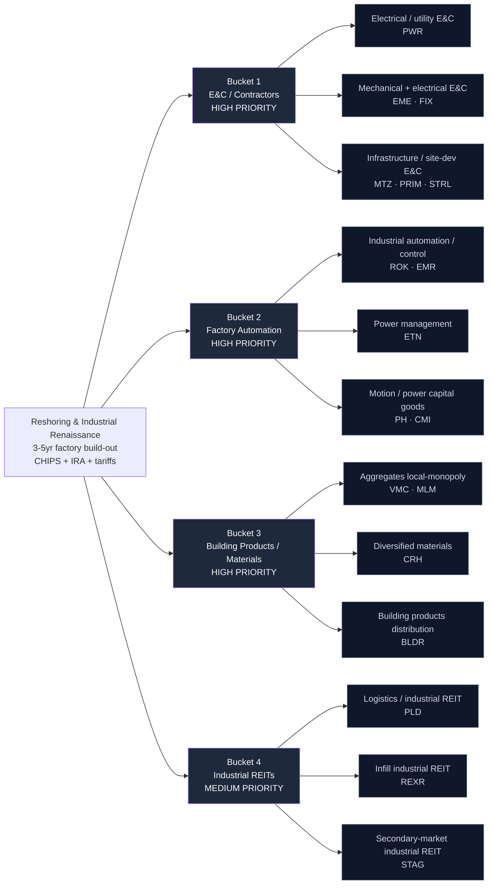

# Reshoring & Industrial Renaissance — Supply Chain Map

_Walks from the locked thesis (`thesis.md`) down to specific public companies. Four buckets matching the thesis priority ranking. Hand-curated. The three key dimensions per leaf node are **backlog visibility**, **pricing power / bottleneck specificity**, and **degree of end-manufacturer dilution** — we want enablers with visible backlogs and structural pricing power, not the end-manufacturers themselves._

**Knowledge cutoff caveat:** Drafted from data current through early 2026. The reshoring cohort has already re-rated on the narrative — several names (STRL, EME, aggregates) carry premium multiples, so the `candidates.md` build should treat entry-multiple discipline as the key open question, not vehicle scarcity.

---

## The chain at a glance

---

## Bucket 1 — E&C / Contractors (HIGH PRIORITY)

**What it is:** The firms that physically build the fabs, gigafactories, grid tie-ins, and site pads. Electrical, mechanical, and site-development construction. This is the most direct expression of "value accrues to the build-out," and backlog visibility is the key screen — record books with book-to-bill above 1 turn cyclical-contractor multiples into visible-earnings compounders.

**Bottleneck specificity / pricing power:** Mixed-to-high. Specialty electrical (PWR) and high-margin site-development (STRL) carry negotiated pricing and scarce skilled-labor moats; broader infra contractors (MTZ, PRIM) are more competitively bid.

**Backlog visibility:** 1-3 years typical; megaproject work extends longest at the specialty electrical/mechanical firms.

### Sub-component: Electrical / utility E&C

| Ticker | Company | Exposure | Note |
|--------|---------|----------|------|
| **PWR** | Quanta Services | Largest specialty electrical + utility contractor; grid, substations, factory power tie-ins | **5** — scarce skilled-labor moat, multi-year backlog; the cleanest enabler expression |

### Sub-component: Mechanical + electrical E&C

| Ticker | Company | Exposure | Note |
|--------|---------|----------|------|
| **EME** | EMCOR Group | Mechanical + electrical construction for factories, data centers, industrial | 4 — record backlog, disciplined buyback culture, strong FCF |
| **FIX** | Comfort Systems USA | Industrial HVAC + modular process piping; direct chip-fab / factory exposure | 4 — modular-mechanical niche, high-margin, direct megaproject exposure |

### Sub-component: Infrastructure / site-development E&C

| Ticker | Company | Exposure | Note |
|--------|---------|----------|------|
| **STRL** | Sterling Infrastructure | Site development for data centers + manufacturing pads; e-infrastructure | 4 — highest-margin E&C in cohort; already re-rated, watch entry multiple |
| **MTZ** | MasTec | Power delivery + communications + clean-energy build | 3 — diversified infra, more competitively bid |
| **PRIM** | Primoris Services | Utility + industrial + renewables construction | 3 — smaller-cap backlog compounder, more bid-competition |

---

## Bucket 2 — Factory Automation & Capital Goods (HIGH PRIORITY)

**What it is:** The automation, control, power-management, and motion/capital-goods suppliers that equip and monetize the plants once construction finishes. As reshored fabs and factories come online they buy control systems, switchgear, drives, and fluid-power/filtration. **Overlap note:** ROK and ETN also appear in AI-Data-Center / Robotics — treated here as the shared, smaller sleeve, with reshoring's distinctiveness carried by buckets 1, 3, 4.

**Bottleneck specificity / pricing power:** High for the automation pure-plays (ROK installed-base + software attach; PH motion/filtration breadth); moderate for the more diversified capital-goods names.

**Backlog visibility:** Shorter than E&C (order books measured in quarters), but installed-base + recurring software/aftermarket attach adds durability.

### Sub-component: Industrial automation / control

| Ticker | Company | Exposure | Note |
|--------|---------|----------|------|
| **ROK** | Rockwell Automation | Purest US factory-automation play; control systems + software attach | **5** — installed-base moat; monetizes plants as they come online. Reference anchor. |
| **EMR** | Emerson Electric | Process automation + measurement; post-reshape pure-play automation | 4 — process-industry exposure, disciplined margins |

### Sub-component: Power management

| Ticker | Company | Exposure | Note |
|--------|---------|----------|------|
| **ETN** | Eaton | Intelligent power management for factories + grid | 4 — real reshoring exposure but overlaps AI-DC theme; shared sleeve |

### Sub-component: Motion / power capital goods

| Ticker | Company | Exposure | Note |
|--------|---------|----------|------|
| **PH** | Parker Hannifin | Motion, fluid power, filtration — the plumbing of automated factories | 4 — aerospace-quality margins, broad content per plant |
| **CMI** | Cummins | Engines + power generation + industrial | 3 — backup power / process capital goods; more diffuse exposure |

---

## Bucket 3 — Building Products / Aggregates / Materials (HIGH PRIORITY)

**What it is:** The physical inputs to every slab, road, and structure in the build-out. Aggregates are the standout — crushed stone is a local-monopoly business (uneconomic to truck >~50 miles), giving each quarry structural, above-inflation pricing power. This is the purest pricing-power layer in the whole theme.

**Bottleneck specificity / pricing power:** Highest in the cohort for aggregates (VMC, MLM) — genuine regional monopolies; high for diversified materials (CRH); lower for building-products distribution (BLDR, more housing-levered).

**Backlog visibility:** Volume-driven rather than backlog-driven; tracks the multi-year construction cycle. Pricing compounds independently of volume.

### Sub-component: Aggregates (local-monopoly)

| Ticker | Company | Exposure | Note |
|--------|---------|----------|------|
| **VMC** | Vulcan Materials | Largest US aggregates producer; crushed stone, sand, gravel | **5** — local-monopoly quarries, pure structural pricing-power play |
| **MLM** | Martin Marietta | #2 US aggregates; heavy infra + factory-slab exposure | **5** — same local-monopoly economics as VMC |

### Sub-component: Diversified materials

| Ticker | Company | Exposure | Note |
|--------|---------|----------|------|
| **CRH** | CRH plc (US-listed) | Aggregates + cement + building products; largest US materials footprint | 4 — NYSE-primary listing (moved from LSE); diversified, scaled |

### Sub-component: Building products distribution

| Ticker | Company | Exposure | Note |
|--------|---------|----------|------|
| **BLDR** | Builders FirstSource | Structural building products + distribution | 3 — scaled beneficiary but more housing-levered than factory-levered |

---

## Bucket 4 — Industrial / Logistics REITs (MEDIUM PRIORITY)

**What it is:** The landlords of the reshored logistics + light-manufacturing footprint. More factories and onshored supply chains mean more demand for warehouse, distribution, and flex-industrial space. Sized medium-priority because REITs are rate-sensitive — the thesis is right but the multiple compresses in a high-rate regime.

**Bottleneck specificity / pricing power:** High for infill land near population centers (REXR, PLD nodes) — effectively un-reproducible, driving large re-leasing spreads; moderate for secondary-market single-tenant (STAG).

**Backlog visibility:** Lease-roll driven — mark-to-market re-leasing spreads provide multi-year embedded rent growth.

### Sub-component: Logistics / industrial REIT

| Ticker | Company | Exposure | Note |
|--------|---------|----------|------|
| **PLD** | Prologis | Largest global logistics REIT; premier US industrial footprint | 4 — scale + data-center optionality; landlords the logistics layer |
| **REXR** | Rexford Industrial | Infill Southern California industrial | 4 — irreplaceable infill land, extreme re-leasing pricing power |

### Sub-component: Secondary-market industrial REIT

| Ticker | Company | Exposure | Note |
|--------|---------|----------|------|
| **STAG** | Stag Industrial | Single-tenant industrial in secondary markets | 3 — higher yield, more diffuse; distribution/manufacturing tenant base |

---

## Explicitly Excluded

Names deliberately left out of the candidate universe, with the reason:

| Ticker / Group | Type | Why excluded |
|----------------|------|--------------|
| **Auto OEMs** (F, GM, TSLA, STLA) | End-manufacturer | Too diffuse — they are the *cost* of the build-out, not the beneficiary; overcapacity + competition cap returns |
| **Generic battery / solar cell makers** (FSLR partial, ENPH, generic gigafactory tenants) | End-manufacturer | Subsidy-cliff risk, Chinese competition, commodity overcapacity — diffuse returns on the reshoring capex |
| **Contract semiconductor fabs as tenants** (INTC, GFS as fabs) | End-manufacturer | We own the *builders and equippers* of fabs, not the fab operators (capital-intensive, competitive, cyclical) |
| **Pure "Made in USA" thematic ETFs** | Basket | Dilute the actual bottleneck exposure by stuffing in any US-domiciled manufacturer |
| **Foreign-primary-listed materials primes** (Holcim, Heidelberg, CRH's old LSE line) | Foreign listing | Not cleanly Fidelity-holdable at scale; CRH included only because it moved to NYSE-primary |
| **Nucor / Steel Dynamics (steelmakers)** | Commodity end-producer | Considered but excluded — commodity steel pricing is import/tariff-whipsawed and diffuse; prefer aggregates' local-monopoly pricing over commodity steel |

---

## Cross-bucket notes

### Overlap with other active themes

- **ROK** and **ETN** appear in AI-Data-Center / Robotics. To keep reshoring differentiated, they are the smaller *shared sleeve* — the theme's unique breadth is the E&C + aggregates + REIT layers no other theme touches.
- **PLD** carries data-center-conversion optionality that overlaps the AI-DC theme; here it is owned for the industrial/logistics landlording, not the DC angle.

### Pricing-power / backlog-visibility ranking (1 = most competitive/replaceable, 5 = hardest to substitute)

| Name | Rating | Notes |
|------|--------|-------|
| VMC / MLM (aggregates) | **5** | Local-monopoly quarries; structural above-inflation pricing |
| PWR (specialty electrical E&C) | **5** | Scarce skilled-labor moat + multi-year backlog |
| ROK (factory automation) | **5** | Installed-base + software attach lock-in |
| REXR / PLD (infill industrial land) | 4 | Un-reproducible land near population centers |
| EME / FIX / STRL (mechanical + site-dev E&C) | 4 | Negotiated backlog, high margin — but STRL/EME already re-rated |
| CRH (diversified materials) | 4 | Scaled, diversified; less pure than aggregates |
| PH (motion / filtration) | 4 | Broad content per plant, aerospace-quality margins |
| EMR / ETN / CMI (automation / capital goods) | 3-4 | Real but more diffuse; ETN overlaps AI-DC |
| MTZ / PRIM (infra E&C) | 3 | More competitively bid than specialty electrical |
| BLDR (building products dist.) | 3 | More housing-levered than factory-levered |
| STAG (secondary industrial REIT) | 3 | Higher yield, more diffuse tenant base |

### Where the thesis is most concentrated (single-name dependence)

- **PWR** is the flagship enabler-contractor — likely highest-conviction on backlog visibility.
- **VMC / MLM** anchor the pricing-power (aggregates) story — the most under-appreciated leg.
- **ROK** is the flagship automation monetization name (shared with other themes).

If any of these has an idiosyncratic issue (megaproject cancellation hitting PWR backlog, an aggregates volume shock, an automation-capex air-pocket), the corresponding leg thins materially.

---

_Next step: `_seed_from_universe.py reshoring` pulls real fundamentals, then `_score_run.py` applies the long-only rubric and shortlists the tracker._
