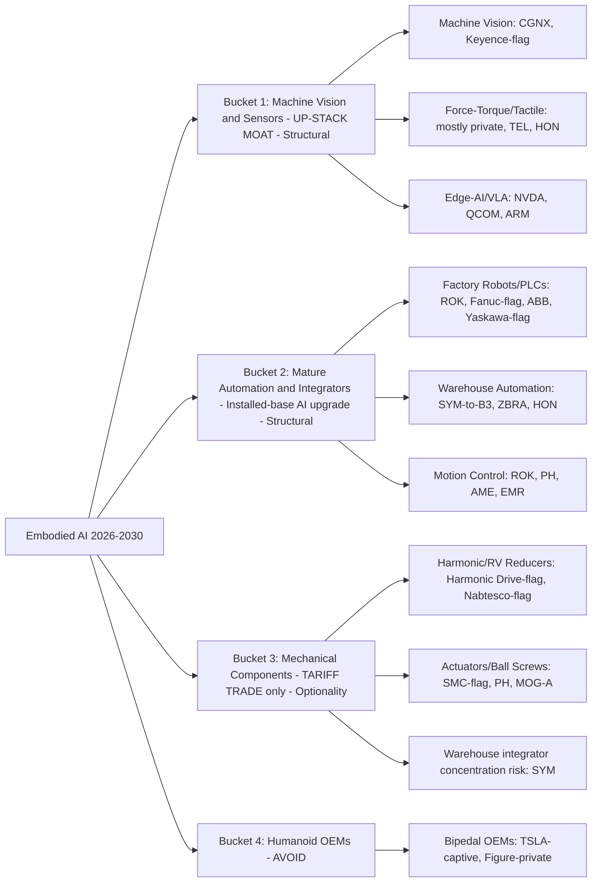

# Robotics & Industrial Automation — Supply Chain Map

_Walks from the locked thesis (`thesis.md`) down to specific public companies. Four buckets matching the thesis structure, each split into sub-components, each sub-component mapped to public tickers plus critical private/upstream players. Hand-curated. The two dimensions that matter most per leaf node: **(a) where the durable moat sits** (the thesis bets it is shifting UP-STACK from mechanicals to sensing/software) and **(b) Fidelity-tradeability** of the vehicle (load-bearing given the brokerage constraint — many of the best names are Tokyo-listed)._

**Knowledge cutoff caveat:** Drafted from data current through May 2025 plus June 2026 web verification of the load-bearing names (CGNX, SYM, Nabtesco/Harmonic Drive, Tesla/Figure). Ticker accessibility (especially Japanese ADRs) MUST be re-verified during the `candidates.md` build — see the FLAG markers inline.

**Reading the thesis into the chain:** The thesis is NOT "robots will be big." It is a specific claim about *where the value accrues*: (1) the **sensing/perception layer** captures the durable moat as AI commoditizes everything mechanical below it; (2) **mature automation incumbents** monetize their installed base via AI software upgrades; (3) **mechanical components** get commoditized by Chinese scale and are held ONLY as a geopolitical tariff re-rating option; (4) **humanoid OEMs** are avoided — their value, if it materializes, accrues to captives (Tesla) and privates (Figure) we can't cleanly hold.

---

## The chain at a glance

_FLAG = Tokyo-listed / foreign primary listing; US ADR may be thin, unsponsored, or not Fidelity-tradeable. Verify before tracker._

---

## Bucket 1 — Machine Vision & Sensors  ·  *the up-stack moat (HIGH / Structural)*

**What it is:** The sensory organs of embodied AI. VLA models are only as good as the perception feeding them. As mechanical hardware commoditizes, the scarce, hard-to-substitute layer becomes the cameras, vision software, force-torque/tactile sensors, and the edge silicon that runs perception locally. This is the thesis's central bet for where durable margin lives.

**Where the moat sits:** HIGH and getting higher. Machine-vision software has switching costs (trained models, integration into production lines) and a monetizable installed base. Tactile/force sensing is technically hard and still largely pre-commodity.

### Machine vision (cameras + vision software)
The load-bearing sub-bucket. CGNX is the cleanest US pure-play and — per the lock — becomes the undisputed pillar if Keyence fails the Fidelity check.

| Ticker | Role | Moat / notes | Fidelity? |
|--------|------|--------------|-----------|
| **CGNX** | US machine-vision pure-play; In-Sight 6900 (NVIDIA) / 3900 (Qualcomm) AI vision | Q1 2026 rev +24% YoY; installed-base software upgrade story | YES — Nasdaq |
| **Keyence** | Dominant global sensor/vision, extraordinary margins | Best-in-class vehicle — but Tokyo-listed (6861.T); ADR unsponsored & thin | FLAG — may not hold in size |
| **ZBRA** | Machine vision (Matrox) + barcode/scanning installed base | Cross-listed into Bucket 2; real logistics base | YES — Nasdaq |

### Force-torque & tactile sensing
Hardest perception problem; mostly private/early. Watch area, not a current tracker leaf.

| Ticker | Role | Notes | Fidelity? |
|--------|------|-------|-----------|
| **TEL** (TE Connectivity) | Sensors + connectors into robotics | Diversified; partial exposure | YES |
| **HON** (Honeywell) | Industrial sensing + warehouse automation | Diversified conglomerate | YES |
| _private_ | dexterous tactile-skin startups | Vehicles-wrong risk: best pure-plays private | — |

### Edge-AI compute & VLA brains
Runs perception/action locally. Also the source of falsifier #4 (open-sourced foundational VLA commoditizes the legacy software moat).

| Ticker | Role | Notes | Fidelity? |
|--------|------|-------|-----------|
| **NVDA** | Jetson edge + Isaac robotics stack | Richly priced; overlaps AI DC theme | YES |
| **QCOM** | Edge-AI silicon (powers CGNX In-Sight 3900); Dragonwing IQ10 | Cheaper edge-AI exposure than NVDA | YES |
| **ARM** | IP in virtually every edge robot controller | US-listed ADR, liquid | YES |

---

## Bucket 2 — Mature Automation & Integrators  ·  *installed-base AI upgrade (HIGH / Structural)*

**What it is:** The established players already inside the world's factories and warehouses — robotic arms, PLCs, drives, motion control, logistics automation. The bet: they generate large new revenue by pushing AI/VLA software upgrades to a massive pre-existing installed base, AND ride the demographic labor-substitution wave with real revenue today.

**Where the moat sits:** MEDIUM-HIGH. Installed base + switching costs + distribution. Risk is falsifier #4 — if VLA software commoditizes, the software-premium portion erodes.

### Factory robots & PLCs
| Ticker | Role | Notes | Fidelity? |
|--------|------|-------|-----------|
| **ROK** (Rockwell) | US PLC/automation leader; AI software upgrade to installed base | Cleanest US structural vehicle | YES |
| **Fanuc** | Global factory-robot leader (CNC + arms) | Best-in-class but Tokyo-listed (6954.T); ADR FANUY thin | FLAG |
| **ABB** | Robotics + electrification; spinning out robotics Q2 2026 | Swiss; ABB NYSE listing is liquid (unlike Japanese names) | YES — verify ADR vs OTC |
| **Yaskawa** | Motion + robots (Motoman) | Tokyo-listed; thin ADR (YASKY) | FLAG |

### Warehouse / logistics automation
| Ticker | Role | Notes | Fidelity? |
|--------|------|-------|-----------|
| **SYM** | AI warehouse automation; $22.7B backlog | ~85% Walmart + Walmart owns part of supply → DEMOTED to Bucket 3 | YES |
| **ZBRA** | Warehouse mobility/scanning + machine vision | Diversified; real installed base | YES |
| **HON** | Warehouse automation (Intelligrated) + sensing | Diversified | YES |

### Motion control / drives
| Ticker | Role | Notes | Fidelity? |
|--------|------|-------|-----------|
| **PH** (Parker) | Motion & control, electric drives, actuators | Diversified industrial; partial | YES |
| **AME** (AMETEK) | Miniature motors/actuators | Diversified | YES |
| **EMR** (Emerson) | Automation software + control | Diversified | YES |

---

## Bucket 3 — Mechanical Components  ·  *TARIFF TRADE ONLY (Optionality, ~20%)*

**The explicit reframe:** Reducers, actuators, ball screws, pneumatics — the physical joints. The thesis says these get **commoditized by Chinese scale (Green Harmonic, FORE)**, so they are held **NOT for organic pricing power but as a geopolitical re-rating option**: if the West tariffs/bans Chinese robotics components (EV-playbook), allied suppliers re-rate as the only NATO-compliant source. **Hard exit:** if Harmonic Drive / Nabtesco guide margins DOWN YoY with no tariff catalyst materializing.

**Where the moat sits:** ERODING — that's the point. A policy bet, not a quality bet.

### Harmonic / RV reducers (the joint bottleneck)
| Ticker | Role | Notes | Fidelity? |
|--------|------|-------|-----------|
| **Harmonic Drive Systems** | Harmonic-reducer incumbent | Tokyo-listed (6324.T); capacity-constrained, losing share to China | FLAG — likely thin / blocked |
| **Nabtesco** | RV-reducer leader; doubling capacity by 2026 | Tokyo-listed (6268.T); same China-erosion risk | FLAG — blocked |

### Actuators / ball screws / pneumatics
| Ticker | Role | Notes | Fidelity? |
|--------|------|-------|-----------|
| **SMC** | Pneumatic/automation actuators | Tokyo-listed (6273.T) | FLAG |
| **MOG-A** (Moog) | Precision electric/hydraulic actuators | US-listed — a holdable Bucket-3 vehicle | YES |
| **PH** (Parker) | Actuators (also Bucket 2) | | YES |

### Warehouse integrator held here for concentration risk
| Ticker | Role | Notes | Fidelity? |
|--------|------|-------|-----------|
| **SYM** | Demoted from Bucket 2 | ~85% Walmart concentration; sized small, named explicitly | YES |

---

## Bucket 4 — Humanoid OEMs  ·  *AVOID*

| Ticker | Why avoided |
|--------|-------------|
| **TSLA** | Optimus optionality only by paying a premium for a mature auto business. Refused. Vehicles-wrong reference anchor. |
| **Figure / Apptronik** | Private — can't hold. The core vehicles-wrong risk: value accrues here, not to public suppliers. |
| pure-play humanoid SPACs / ETFs (BOTT etc.) | Cash-burning, winner-take-most, no installed base. Avoid. |

---

## Cross-theme overlaps (flag, don't suppress)

Per the accepted-overlap rule: **NVDA** and adjacent compute names also live in the AI Data Center theme; **HON/PH/AME** touch multiple industrial themes. Natural 2x positions if they make multiple trackers — each tracker stays true to itself.

## The two questions that decide this theme's vehicles

1. **Fidelity-tradeability of the Japanese names** (Keyence, Fanuc, Harmonic Drive, Nabtesco, SMC). If most fail, the structural buckets compress onto CGNX + ROK + ZBRA + ABB, and the thesis leans far harder on CGNX. **Resolved in `candidates.md`.**
2. **Does the tariff catalyst materialize?** Bucket 3's entire rationale. No catalyst + margin compression = the documented hard exit.

---

## Next stage

`candidates.md` — pull fundamentals on holdable names, run the Fidelity-tradeability check on every FLAG, propose US-listed proxies where a FLAG name can't be held, then score in `scoring.md`. Rubric weights **moat-location (up-stack)** and **vehicle accessibility** heavily, mirroring how Space/Defense weighted capital structure.
