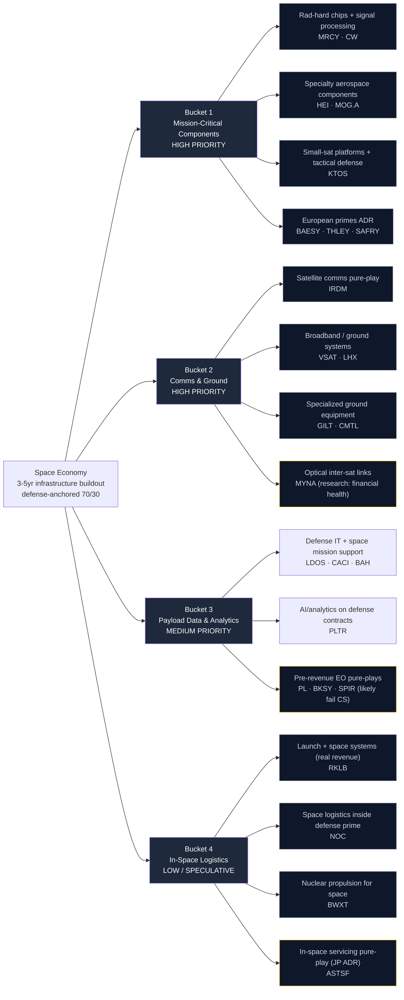

# Space Economy — Supply Chain Map

_Walks from the locked thesis (`thesis.md`) down to specific public companies. Four buckets matching the thesis priority ranking. Hand-curated. Bottleneck specificity, real-revenue presence, and capital structure are the three key dimensions per leaf node — the third matters more here than in AI DC because the "vehicles wrong" risk is central, not tail._

**Knowledge cutoff caveat:** Drafted from data current through early 2025. The space sector is rapidly evolving with SPAC washouts, takeouts, and ongoing dilution — verify each ticker's current state during the `candidates.md` build. **Two specific items flagged for active research:** Mynaric's current financial health (RR question) and any Starlink IPO timing signals (would materially change the competitive landscape).

---

## The chain at a glance

_Yellow border = research / speculative — see Open Research Questions._

---

## Bucket 1 — Mission-Critical Subsystems & Components (HIGH PRIORITY)

**What it is:** Specialized hardware for satellites and launch vehicles that must survive radiation, extreme thermal cycles, and zero-gravity. The "AI-data-center-heavy-electrical-equipment" analogue — boring, durable, hard to substitute, often with multi-year backlogs. This is where the thesis says we'll find the most concentrated upside.

**Bottleneck specificity:** Mixed but generally high. Rad-hard chip suppliers are a global oligopoly. Specialty aerospace components (HEI-style) have lower per-product moats but compounding pricing power across thousands of SKUs.

**Lead times:** Rad-hard semiconductors 26-52 weeks; specialty mechanical components 16-32 weeks; precision motion control (MOG.A space-grade) 30+ weeks.

### Sub-component: Rad-hard chips and signal processing

| Ticker | Role | Bottleneck specificity |
|--------|------|------------------------|
| **MRCY** (Mercury Systems) | Rad-hard processors, secure data fabric, mission-critical defense electronics | **4** — specialized, ~5 global competitors at this tier |
| **CW** (Curtiss-Wright) | Defense electronics, nuclear, sensors. Real but diluted space exposure | 3 — broad portfolio |

### Sub-component: Specialty aerospace mechanical / propulsion components

| Ticker | Role | Bottleneck specificity |
|--------|------|------------------------|
| **HEI** (Heico) | Specialty aerospace parts compounder; very high quality with consistent pricing power | 3 — diluted exposure but exceptional execution |
| **MOG.A** (Moog) | Precision motion control + valves for satellite propulsion + launch vehicle actuators | **4** — specialized aerospace-grade hardware |

### Sub-component: Small-sat platforms and tactical defense electronics

| Ticker | Role | Bottleneck specificity |
|--------|------|------------------------|
| **KTOS** (Kratos Defense) | Small satellites + target drones + space-adjacent defense electronics. Real revenue but small cap | 3 — narrower customer base, growing fast |

### Sub-component: European primes (ADR-accessible)

| Ticker | Role | Bottleneck specificity |
|--------|------|------------------------|
| **BAESY** (BAE Systems) | UK defense prime, real space exposure. Recent US Falcon-style acquisitions strengthening US position | 3 — diluted but real |
| **THLEY** (Thales) | French defense + Thales Alenia Space JV with Leonardo (one of three EU satellite primes). Large satellite manufacturing footprint | 4 — major satellite OEM |
| **SAFRY** (Safran) | French propulsion + actuators. Space exposure through propulsion + small-sat platforms | 3 — engines/turbines dominate |

---

## Bucket 2 — Space Comms & Ground Infrastructure (HIGH PRIORITY)

**What it is:** The middleware of space — getting data from orbit to Earth, between satellites, and into customer hands. Cheap launch means thousands more satellites generating petabytes of data; comms + ground infrastructure must scale to absorb it.

**Bottleneck specificity:** Mixed. Specialized satellite comms operators with global L-band rights (IRDM) hold near-monopoly positions in specific frequency bands. Optical inter-satellite links are an emerging technical category with very few qualified suppliers. Ground systems are more competitive.

**Lead times:** Satellite phased arrays 40-60 weeks; ground modems 12-24 weeks; optical comms terminals 36+ weeks for new designs.

### Sub-component: Satellite communications pure-play

| Ticker | Role | Bottleneck specificity |
|--------|------|------------------------|
| **IRDM** (Iridium) | The cleanest public pure-play in the entire space supply chain. Owns L-band spectrum rights globally, $800M+ revenue, real cash flow, growing. The "what we actually want" reference name. | **5** — near-monopoly on L-band orbit-to-ground for IoT + government |

### Sub-component: Broadband + diversified ground systems

| Ticker | Role | Bottleneck specificity |
|--------|------|------------------------|
| **VSAT** (Viasat) | Post-Inmarsat acquisition. Broadband + IFC (in-flight connectivity) + maritime + government. D2D side faces over-hype concerns | 3 — execution challenged post-merger |
| **LHX** (L3Harris) | Space comms + tactical communications. More pure-play than other defense primes on the comms side | 4 — strong real revenue in narrow band |

### Sub-component: Specialized ground equipment

| Ticker | Role | Bottleneck specificity |
|--------|------|------------------------|
| **GILT** (Gilat Satellite Networks) | Israeli ground systems + VSAT terminals + IFC components. $300M+ revenue, specialized | 3 — narrow but real |
| **CMTL** (Comtech) | Modems, ground systems, microwave. Small cap, troubled execution | 2 — turnaround story; treat with caution |

### Sub-component: Optical inter-satellite laser links

| Ticker | Role | Bottleneck specificity |
|--------|------|------------------------|
| **MYNA** (Mynaric) | German optical inter-satellite links pure-play, US-listed. **Open research: financial health unclear** — has had cash burn concerns | **4** if solvent — true pure-play in a high-priority technology |

---

## Bucket 3 — Payload Data & Defense Analytics (MEDIUM PRIORITY)

**What it is:** Software, analytics, and services that turn raw satellite data into intelligence products. Defense buyers (NRO, NGA, Space Force) anchor demand. Commercial-only plays are explicitly flagged as over-hyped in the thesis.

**Bottleneck specificity:** Lower than buckets 1-2. Software has lower switching costs and faster commoditization, but defense IT firms with security clearances + long-standing contracts have effective moats from procurement frameworks rather than technical specificity.

### Sub-component: Defense IT + space mission support

| Ticker | Role | Bottleneck specificity |
|--------|------|------------------------|
| **LDOS** (Leidos) | Largest defense IT contractor, deep NRO/Space Force relationships. Real margins | 3 — diluted but high-quality |
| **CACI** (CACI International) | Defense IT, intelligence community, electronic warfare. Real revenue + clean balance sheet | 3 — specialized but broad |
| **BAH** (Booz Allen Hamilton) | Government consulting including space mission support. Highest-quality balance sheet of the three | 3 — diluted |

### Sub-component: AI/analytics on defense contracts

| Ticker | Role | Bottleneck specificity |
|--------|------|------------------------|
| **PLTR** (Palantir) | Foundry platform deployed across defense including Space Force contracts. Recent NRO + Maven program wins | 3 — broad applicability; high SBC likely caps CS score |

### Sub-component: Pre-revenue Earth observation (likely to fail CS bar)

These are flagged here for completeness, but the thesis "real revenue today" mandate will probably reject all three at scoring. Worth tracking on a watch list in case any reach inflection.

| Ticker | Status | Why flagged |
|--------|--------|-------------|
| **PL** (Planet Labs) | Pre-profitable, persistent dilution | Real product (daily imagery) but commercial unit economics challenging |
| **BKSY** (BlackSky) | SPAC-origin, micro-cap, cash burn | Real defense contracts but capital intensity outpaces them |
| **SPIR** (Spire Global) | SPAC-origin, micro-cap | Weather + ship tracking; needs scale that hasn't materialized |

---

## Bucket 4 — In-Space Logistics & Satellite Architecture (LOW / SPECULATIVE)

**What it is:** Satellite buses, orbital transfer vehicles, refueling, space domain awareness, in-orbit servicing. The most futuristic bucket — most monetization is 5-10 years out, not 3-5. **The thesis explicitly says: names here must clear a higher bar on capital structure + real revenue today.**

**Bottleneck specificity:** Very high at the leading edge (only a handful of companies globally are even attempting), but commercial demand is mostly aspirational. We're betting on optionality, not cash flow.

### Sub-component: Launch + space systems with real revenue

| Ticker | Role | Bottleneck specificity |
|--------|------|------------------------|
| **RKLB** (Rocket Lab) | Small launch (Electron) + space systems (Photon bus, solar arrays, reaction wheels). **$350M+ revenue, real customers including Space Force, NASA, government**. Has graduated from SPAC into real business. Promising but heavy capex | 4 — one of two viable Western alternatives to SpaceX in small launch |

### Sub-component: In-space logistics inside defense prime

| Ticker | Role | Bottleneck specificity |
|--------|------|------------------------|
| **NOC** (Northrop Grumman) | Owns SpaceLogistics (MEV — Mission Extension Vehicles, the only currently-operating in-orbit servicing business). Plus B-21, missile defense, strategic systems. Heavily diluted but the SpaceLogistics business is real | 4 — only commercial operator in this segment |

### Sub-component: Specialty propulsion (nuclear)

| Ticker | Role | Bottleneck specificity |
|--------|------|------------------------|
| **BWXT** (BWX Technologies) | Nuclear propulsion for space (DARPA DRACO program); also makes nuclear reactor components for navy submarines + commercial nuclear (overlaps with AI DC nuclear). Real revenue from nuclear, space-specific revenue is small | 4 — extreme bottleneck specificity in nuclear space propulsion |

### Sub-component: In-space servicing pure-play (Japan ADR)

| Ticker | Role | Bottleneck specificity |
|--------|------|------------------------|
| **ASTSF** (Astroscale Holdings) | Japanese ADR. Active debris removal + life extension services for satellites. **Pure-play but pre-revenue** — will struggle on CS criterion | 5 if successful — only Western pure-play in active debris removal; **but high failure risk** |

---

## Defense primes that span all buckets (vehicles-wrong reference)

These are the "if SpaceX stays private, do mega-cap defense primes capture the upside?" names. **Listed for context, NOT recommended for the candidate list** — they are the *negative space* of the thesis. If our pure-plays underperform these names over 12-24 months, the "vehicles wrong" falsifier is firing.

| Ticker | Role | Why not in candidate list |
|--------|------|-------------------------|
| **LMT** (Lockheed Martin) | F-35, missiles, space systems. ~15% revenue space-related | Too diluted — buying mostly aerospace, not the space buildout |
| **RTX** (RTX Corp) | Broad defense + commercial aerospace. Small space slice | Same — heavy commercial aero dilution |
| **GD** (General Dynamics) | Submarines + IT + tanks. Almost no space revenue | Wrong vehicle entirely |

**However:** LMT specifically is in our benchmark anchors as the "vehicles wrong" reference name. We track it not because we own it, but because if LMT outperforms our actual picks by ≥10pp over 12 months, that's a signal the diluted-prime strategy was correct and our pure-play selection failed.

---

## Cross-bucket notes

### Names that span multiple buckets

- **LHX (L3Harris):** Bucket 2 (space comms) + Bucket 1 (defense electronics). Real space comms revenue makes it more pure-play than LMT/RTX/NOC.
- **NOC (Northrop Grumman):** Bucket 4 (SpaceLogistics) + adjacent Bucket 1 (strategic space systems). Diluted overall but the in-orbit servicing business is unique.
- **BWXT (BWX Technologies):** Bucket 4 (nuclear space propulsion) + cross-theme overlap with AI Data Center nuclear narrative.

### Bottleneck specificity ranking (1 = most replaceable, 5 = hardest to substitute)

| Sub-component | Rating | Notes |
|---------------|--------|-------|
| IRDM (L-band satellite comms) | **5** | Near-monopoly in licensed orbit-to-ground IoT comms |
| ASTSF (active debris removal) | **5** | Only Western pure-play, but failure risk is also extreme |
| Rad-hard chips (MRCY) | 4 | ~5 global competitors at top tier |
| Optical inter-satellite links (MYNA) | 4 | Few suppliers, emerging technology — financial-health caveat |
| MV propulsion / motion control (MOG.A) | 4 | Specialized aerospace-grade hardware |
| Nuclear space propulsion (BWXT) | 4 | Extreme regulatory + technical moat |
| Small launch + space systems (RKLB) | 4 | One of two Western alternatives to SpaceX in small launch |
| In-orbit servicing (NOC SpaceLogistics) | 4 | Only currently operating commercial in-orbit servicer |
| European primes (THLEY, BAESY, SAFRY) | 3 | Major satellite OEM but diluted exposure |
| Specialty aerospace components (HEI, CW) | 3 | Compounders with consistent pricing |
| Defense IT analytics (LDOS, CACI, BAH) | 3 | Procurement-framework moat rather than technical |
| Specialty ground equipment (GILT, CMTL) | 3 | Narrow but real |
| Pre-revenue EO (PL, BKSY, SPIR) | 2 | Real products but capital structure failures likely |

### Where the "thesis right, vehicles wrong" risk concentrates

This is the **central risk** for the Space Economy thesis (not tail risk). Specific concentrations:

1. **SpaceX stays private indefinitely.** Best-positioned company in the entire supply chain captures all the upside without any public expression. No mitigation possible — we either find Starlink/Starship-adjacent value elsewhere or accept the constraint.
2. **Defense primes absorb the best pure-plays.** If LMT acquires RKLB or NOC absorbs ASTSF at modest premiums (under 25%), the per-share upside gets clipped. This is the formal falsifier in thesis.md.
3. **Hyperscaler ground-station-as-a-service.** AWS Ground Station + Microsoft Azure Orbital compress IRDM/VSAT margins by offering scalable infrastructure. Already happening at the edges.
4. **Pre-revenue pure-plays never reach scale.** ASTS, LUNR, RDW, PL, BKSY, SPIR all have real products but persistent dilution. The capital structure criterion will heavily penalize them at scoring; if they DON'T reach scale, our screen is right and we avoid losses.

### Where the thesis is most concentrated (single-name dependence)

- **IRDM** is the flagship pure-play — likely to be the highest-conviction tracker candidate
- **RKLB** is the flagship "speculative bucket 4 that passes the CS bar" name
- **MRCY + MOG.A** anchor the Bucket 1 components story

If any of these three has an idiosyncratic issue (accounting, leadership turnover, regulatory hit), the thesis vehicles get materially thinner. Worth treating as a portfolio-construction note in `scoring.md`.

---

## Open research questions (for resolution before tracker lock)

1. **MYNA (Mynaric) financial health.** Pure-play optical inter-satellite links with real US listing, but cash burn rate and balance sheet quality are unclear in my data. Need a focused review — if MYNA fails the CS criterion, optical-comms has *no* viable public pure-play vehicle, and the sub-bucket should be expressed through Bucket 1 component suppliers instead.

2. **Starlink IPO timing signals.** If SpaceX spins out Starlink publicly in the 3-5 year window, it materially changes the entire competitive landscape — and the "vehicles wrong" calculus shifts dramatically (IRDM's L-band would face direct broadband competition). Watch for SEC filings, S-1 leaks, or any Musk public statements on Starlink valuation. Current consensus is "no IPO before 2027" but signals can move fast.

3. **Ground-station-as-a-service threat sizing.** AWS Ground Station + Microsoft Azure Orbital are real and growing. How fast does this commoditize IRDM's pricing power? IRDM's L-band monopoly is regulation-protected, so probably not directly threatened — but their data downlink margins could compress as alternatives scale. Need to read recent IRDM earnings transcripts for management's framing.

4. **AI-powered earth observation analytics commoditization.** If general-purpose foundation models can do most of what Planet, BlackSky, and Spire's analytics offerings claim, the entire commercial EO sub-bucket gets disrupted. Already affecting valuations. Worth a sanity check on whether LDOS / CACI / BAH face the same risk from AI commoditization of intelligence processing.

5. **European/Japanese ADR liquidity for retail accounts.** BAESY, THLEY, SAFRY, ASTSF are ADRs — but liquidity and bid/ask spreads matter for actual position sizing. Confirm these are actually buyable in standard US brokerage accounts (Fidelity per the user's brokerage memory) without penalty.

---

_Next step: extend `themes/refresh_data.py` UNIVERSES dict with the 21 candidate tickers, trigger daily refresh on Railway, then write `_score_run.py` for Space and score the cohort. Likely a faster cycle than AI DC since the infrastructure exists._
